# Enhanced Bills & Budget System — Architecture Document

> **Author:** Architect Agent  
> **Date:** July 21, 2025  
> **Status:** Implemented  
> **Migration:** `app/Supabase/enhance-bills-migration.sql`

---

## Table of Contents

1. [Executive Summary](#1-executive-summary)
2. [Enhanced Bills Data Model](#2-enhanced-bills-data-model)
3. [Budget Auto-Population](#3-budget-auto-population)
4. [Payoff Tracking System](#4-payoff-tracking-system)
5. [Entity Relationship Diagram](#5-entity-relationship-diagram)
6. [Data Flow Diagrams](#6-data-flow-diagrams)
7. [Frontend Integration Guide](#7-frontend-integration-guide)
8. [API Reference](#8-api-reference)
9. [Migration Notes](#9-migration-notes)
10. [Decision Log](#10-decision-log)

---

## 1. Executive Summary

The enhanced bills & budget system transforms the basic `bills` table into a full-featured recurring payment manager with:

- **Payoff tracking** for finite bills (car payments, financed purchases) with % complete and estimated payoff dates
- **Variable bill support** for utilities that change month-to-month
- **Budget auto-population** that generates monthly budget entries from active bills
- **Status lifecycle** for automatic bill roll-off when paid in full
- **Gmail integration readiness** via `email_source` field for future auto-updating

### What Changed

| Before | After |
|--------|-------|
| 7 columns (id, user_id, created_at, name, type, amount, frequency, nextDueDate) | 17 columns (+10 new) |
| No payoff tracking | Full payoff % + estimated payoff date |
| No variable bill support | `is_variable` flag with budget estimation logic |
| No status lifecycle | `active` → `paid_off` / `cancelled` |
| Manual budget entry | Auto-population function |
| No payment method tracking | Payment method + auto-draft flag |

---

## 2. Enhanced Bills Data Model

### 2.1 Complete Column Reference

| Column | Type | Default | New? | Description |
|--------|------|---------|------|-------------|
| `id` | `uuid` | `gen_random_uuid()` | — | Primary key |
| `user_id` | `uuid` | — | — | FK → auth.users |
| `created_at` | `timestamptz` | `now()` | — | Record creation timestamp |
| `name` | `text` | — | — | Bill name (e.g., "West Penn Power") |
| `type` | `text` | — | — | Category (e.g., "Utility", "auto", "financing") |
| `amount` | `numeric` | — | — | Current monthly payment amount |
| `frequency` | `text` | — | — | Payment frequency ("Monthly", "Quarterly", etc.) |
| `nextDueDate` | `date` | — | — | Next payment due date |
| `end_date` | `date` | `NULL` | ✅ | When the bill ends (NULL = indefinite) |
| `total_amount` | `numeric` | `NULL` | ✅ | Original financed amount for payoff tracking |
| `payments_made` | `integer` | `0` | ✅ | Count of payments made toward total_amount |
| `is_auto_draft` | `boolean` | `false` | ✅ | Whether payment is auto-drafted |
| `is_variable` | `boolean` | `false` | ✅ | Whether amount changes monthly |
| `payment_method` | `text` | `NULL` | ✅ | How it's paid (e.g., "Robinhood CC") |
| `status` | `text` | `'active'` | ✅ | Lifecycle: 'active', 'paid_off', 'cancelled' |
| `email_source` | `text` | `NULL` | ✅ | Email sender for auto-updates |
| `notes` | `text` | `NULL` | ✅ | Free-form notes |

### 2.2 Bill Categories

Based on the founder's recurring bills spreadsheet, bills fall into these categories:

| Category | Bills | Characteristics |
|----------|-------|-----------------|
| **Housing** | Mortgage, HOA Fees | Fixed, indefinite, auto-draft |
| **Auto** | BMW Payment, BMW 430i, Chevy Tahoe | Fixed, finite, auto-draft |
| **Utilities** | Electric, Water, Sewage, Gas | **Variable**, indefinite, mixed payment methods |
| **Utilities (Fixed)** | Cell Phone, Internet | Fixed, indefinite, auto-draft |
| **Financing** | Big Green Egg, XGIMI, Golf Clubs | Fixed, **finite with payoff tracking** |
| **Health** | GLP-1 | Fixed, indefinite, auto-draft |
| **Subscriptions** | USC Rec | Fixed, indefinite, auto-draft |

### 2.3 Status Lifecycle


### 2.4 Indexes

| Index | Columns | Purpose |
|-------|---------|---------|
| `idx_bills_status` | `status` | Filter by bill lifecycle status |
| `idx_bills_user_status` | `user_id, status` | User's active bills (most common query) |

---

## 3. Budget Auto-Population

### 3.1 Problem

Each month, the user needs budget entries for all recurring bills. Previously this was manual. Now we auto-generate them.

### 3.2 Solution: `generate_monthly_budget()` Function

**Postgres function** that creates budget entries for a target month from active bills.

```sql
SELECT generate_monthly_budget('8b6aca68-6072-457d-8053-7e81e41bfef3', '2025-08');
-- Returns: 16 (number of entries created/updated)
```

### 3.3 Logic Flow


### 3.4 Variable Bill Estimation

For bills marked `is_variable = true` (Electric, Water, Sewage, Gas):

1. **Primary**: Use last month's **assigned_amount** from budgets table
2. **Fallback**: Use the bill's current `amount` field
3. **Future enhancement**: Use 3-month rolling average when email integration provides historical data

**Why assigned_amount, not needed_amount?**
The user may manually adjust the budget assignment (e.g., budget $150 for electric even though last month was $87). We respect their override for the next month's estimate.

### 3.5 Budget Entry Structure

Each auto-generated budget entry:

```json
{
  "user_id": "8b6aca68-...",
  "month": "2025-08",
  "item_id": "045ff7c2-...",       // ← bill.id
  "item_type": "bill",
  "name": "West Penn Power",       // ← bill.name
  "category": "Utility",           // ← bill.type
  "needed_amount": 87.44,          // ← calculated (see logic above)
  "assigned_amount": 87.44         // ← defaults to needed, user can override
}
```

### 3.6 When to Call

| Trigger | Method | Notes |
|---------|--------|-------|
| **User clicks "Generate Budget"** | Frontend calls Supabase RPC | Primary method initially |
| **Start of month (future)** | Supabase pg_cron or Azure Function | Automate with Phase 2 |
| **New bill added** | Frontend calls after bill insert | Generate entry for current month |

**Frontend RPC call:**
```javascript
const { data, error } = await supabase.rpc('generate_monthly_budget', {
    p_user_id: user.id,
    p_month: '2025-08'
});
// data = 16 (count of entries)
```

---

## 4. Payoff Tracking System

### 4.1 How Payoff Tracking Works

For finite bills (where `total_amount` is set):

| Field | Source | Example (Big Green Egg) |
|-------|--------|------------------------|
| `amount` | Monthly payment | $324.52 |
| `total_amount` | Original financed total | $3,894.24 |
| `payments_made` | Count of payments made | 8 |
| **Calculated: total_paid** | `payments_made × amount` | $2,596.16 |
| **Calculated: remaining** | `total_amount - total_paid` | $1,298.08 |
| **Calculated: % complete** | `total_paid / total_amount × 100` | 66.7% |
| **Calculated: remaining payments** | `⌈remaining / amount⌉` | 4 |
| **Calculated: payoff date** | `today + remaining_payments months` | ~Nov 2025 |

### 4.2 The `bill_payoff_progress` View

A Postgres view that computes all payoff fields for the frontend:

```sql
SELECT * FROM bill_payoff_progress WHERE user_id = '8b6aca68-...';
```

Returns:

| Column | Type | Description |
|--------|------|-------------|
| `monthly_payment` | numeric | Current payment amount |
| `total_amount` | numeric | Original total |
| `payments_made` | integer | Payments completed |
| `total_paid` | numeric | payments_made × amount |
| `remaining_balance` | numeric | total_amount − total_paid |
| `payoff_percent` | numeric | 0–100 |
| `remaining_payments` | integer | Months left |
| `estimated_payoff_date` | date | Projected completion |

### 4.3 Applying the View to Known Bills

| Bill | Amount | Total | Payments Made | % Complete | Status |
|------|--------|-------|---------------|------------|--------|
| Golf Clubs | $208.42 | ~$2,501.04 (12 mo) | 12 | 100% | **paid_off** ✅ |
| XGIMI | $136.36 | ~$1,636.32 (12 mo) | 10 (est.) | 83.3% | active |
| Big Green Egg | $324.52 | ~$3,894.24 (12 mo) | 8 (est.) | 66.7% | active |
| BMW Payment | $1,534.00 | TBD | TBD | TBD | active |
| BMW 430i | $411.00 | TBD | TBD | TBD | active |
| Chevy Tahoe | $636.88 | TBD | TBD | TBD | active |

> **Note:** The founder will need to provide exact `total_amount` and `payments_made` values for each finite bill. The estimates above assume 12-month financing for small purchases.

### 4.4 Auto-Payoff Detection

The `check_bill_payoffs()` function scans for bills where total_paid ≥ total_amount:

```sql
SELECT check_bill_payoffs('8b6aca68-...');
-- Returns count of bills marked as paid_off
```

**Condition:**
```sql
WHERE status = 'active'
  AND total_amount IS NOT NULL
  AND total_amount > 0
  AND payments_made IS NOT NULL
  AND (payments_made * amount) >= total_amount
```

### 4.5 Recording a Payment

When the user (or automation) records a bill payment:

1. Increment `payments_made` by 1
2. Advance `nextDueDate` by one period
3. Call `check_bill_payoffs()` to auto-close if complete

```javascript
// Frontend: Record payment for Big Green Egg
const { error } = await supabase
    .from('bills')
    .update({
        payments_made: currentPaymentsMade + 1,
        nextDueDate: nextMonthDate
    })
    .eq('id', billId);

// Then check for payoffs
await supabase.rpc('check_bill_payoffs', { p_user_id: user.id });
```

---

## 5. Entity Relationship Diagram


---

## 6. Data Flow Diagrams

### 6.1 Monthly Budget Generation

```mermaid
sequenceDiagram
    participant U as User / Cron
    participant FE as Frontend
    participant SB as Supabase
    participant PG as Postgres Function
    
    U->>FE: Click "Generate August Budget"
    FE->>SB: rpc('generate_monthly_budget', {user_id, '2025-08'})
    SB->>PG: Execute function
    PG->>PG: Fetch active bills WHERE status='active'
    loop Each active bill
        PG->>PG: Check is_variable
        alt Variable bill
            PG->>PG: Lookup July budget assigned_amount
            PG->>PG: Fallback to bill.amount if no July entry
        else Fixed bill
            PG->>PG: Use bill.amount
        end
        PG->>PG: UPSERT into budgets
    end
    PG-->>SB: Return count (e.g., 16)
    SB-->>FE: {data: 16}
    FE-->>U: "✅ Generated 16 budget entries for August"
```



### 6.2 Payment Recording & Payoff Check

```mermaid
sequenceDiagram
    participant U as User
    participant FE as Frontend
    participant SB as Supabase
    
    U->>FE: Click "Record Payment" on Big Green Egg
    FE->>SB: UPDATE bills SET payments_made = 9 WHERE id = '...'
    SB-->>FE: OK
    FE->>SB: rpc('check_bill_payoffs', {user_id})
    SB->>SB: Check all finite bills
    alt payments_made × amount >= total_amount
        SB->>SB: SET status = 'paid_off'
        SB-->>FE: {data: 1} (1 bill paid off)
        FE-->>U: "🎉 Big Green Egg is paid off!"
    else Still active
        SB-->>FE: {data: 0}
        FE-->>U: "Payment recorded. 3 payments remaining."
    end
```



### 6.3 Variable Bill Update (Future: Email Integration)


---

## 7. Frontend Integration Guide

### 7.1 Querying Active Bills with New Fields

```javascript
// Get all active bills with enhanced fields
const { data: bills } = await supabase
    .from('bills')
    .select('*')
    .eq('status', 'active')
    .order('nextDueDate', { ascending: true });
```

### 7.2 Querying Payoff Progress

```javascript
// Get payoff progress for all finite bills
const { data: payoffs } = await supabase
    .from('bill_payoff_progress')
    .select('*');

// Example response:
// {
//   name: "Big Green Egg",
//   monthly_payment: 324.52,
//   total_amount: 3894.24,
//   payments_made: 8,
//   total_paid: 2596.16,
//   remaining_balance: 1298.08,
//   payoff_percent: 66.7,
//   remaining_payments: 4,
//   estimated_payoff_date: "2025-11-21",
//   status: "active"
// }
```

### 7.3 Generating Monthly Budget

```javascript
// Generate budget for August 2025
const { data: count } = await supabase.rpc('generate_monthly_budget', {
    p_user_id: user.id,
    p_month: '2025-08'
});
console.log(`Generated ${count} budget entries`);
```

### 7.4 Payoff Progress Bar Component

```html
<!-- Example payoff card for bills page -->
<div class="card mb-3">
    <div class="card-body">
        <h6 class="card-title">Big Green Egg</h6>
        <div class="progress mb-2" style="height: 20px;">
            <div class="progress-bar bg-success" 
                 role="progressbar" 
                 style="width: 66.7%"
                 aria-valuenow="66.7" aria-valuemin="0" aria-valuemax="100">
                66.7%
            </div>
        </div>
        <small class="text-muted">
            $2,596.16 of $3,894.24 paid · 4 payments left · Est. payoff: Nov 2025
        </small>
    </div>
</div>
```

### 7.5 Variable Bill Indicator

```javascript
// Show variable bill warning on budget page
if (bill.is_variable) {
    badge = '<span class="badge bg-warning">Variable</span>';
    tooltip = 'This amount varies. Based on last month\'s budget.';
}
```

---

## 8. API Reference

### 8.1 Supabase RPC Functions

| Function | Parameters | Returns | Description |
|----------|-----------|---------|-------------|
| `generate_monthly_budget` | `p_user_id uuid, p_month text` | `integer` (count) | Auto-populate budget from active bills |
| `check_bill_payoffs` | `p_user_id uuid` | `integer` (count) | Mark fully-paid bills as 'paid_off' |

### 8.2 Views

| View | Description | Key Columns |
|------|-------------|-------------|
| `bill_payoff_progress` | Computed payoff data for finite bills | `payoff_percent`, `remaining_balance`, `estimated_payoff_date`, `remaining_payments` |

### 8.3 REST Endpoints (via Supabase PostgREST)

```
GET    /rest/v1/bills?status=eq.active              # Active bills only
GET    /rest/v1/bills?is_variable=eq.true            # Variable bills
GET    /rest/v1/bill_payoff_progress?select=*        # Payoff progress view
PATCH  /rest/v1/bills?id=eq.{id}                     # Update bill fields
POST   /rest/v1/rpc/generate_monthly_budget          # Generate budget
POST   /rest/v1/rpc/check_bill_payoffs               # Check payoffs
```

---

## 9. Migration Notes

### 9.1 Backward Compatibility

- ✅ All existing columns unchanged
- ✅ All new columns have defaults or allow NULL
- ✅ RLS policies unaffected (no new table-level policies needed)
- ✅ Existing foreign keys preserved
- ✅ `IF NOT EXISTS` guards on all ALTERs (idempotent)

### 9.2 Relationship to Email Integration

The `email_source` column on bills is a forward-looking field for the planned email integration (see `docs/architecture/email-integration.md`). When email scanning is implemented:

- `email_source` stores the sender pattern (e.g., `noreply@peoples-gas.com`)
- The email scanner matches incoming emails to bills by this field
- Variable bill amounts auto-update when a new bill email arrives
- The email integration's `source` and `source_id` columns will be added separately in that migration

### 9.3 Data Backfill Required

After running the migration, the following bills need metadata populated:

| Bill | `is_variable` | `is_auto_draft` | `total_amount` | `payments_made` | `status` |
|------|--------------|-----------------|----------------|-----------------|----------|
| People's Gas | ✅ true | ✅ true | — | — | active |
| American Water | ✅ true | ❌ false | — | — | active |
| West Penn Power | ✅ true | ✅ true | — | — | active |
| Sewage | ✅ true | ✅ true | — | — | active |
| Verizon Wireless | ❌ false | ✅ true | — | — | active |
| BMW Lease | ❌ false | ✅ true | TBD | TBD | active |
| Turbo Tax | ❌ false | ✅ true | — | — | active |
| HOA Fees | ❌ false | ✅ true | — | — | active |

**New bills to add from spreadsheet** (not yet in Supabase):

| Bill | Amount | Type | Notes |
|------|--------|------|-------|
| Mortgage | $1,069 | housing | Fixed, auto-draft |
| BMW Payment | $1,534 | auto | Finite, needs total_amount |
| BMW 430i | $411 | auto | Finite, manual sometimes |
| Chevy Tahoe | $636.88 | auto | Finite, needs total_amount |
| Cell Phone | $200.51 | utilities | Fixed, auto-draft |
| Internet | $89.99 | utilities | Reimbursed by work |
| Big Green Egg | $324.52 | financing | Finite, needs payoff data |
| XGIMI | $136.36 | financing | Finite, close to paid off |
| Golf Clubs | $208.42 | financing | **PAID OFF** |
| GLP-1 | $349 | health | Fixed, auto-draft |
| USC Rec | $52 | subscriptions | Robinhood CC |

---

## 10. Decision Log

| # | Decision | Rationale | Alternatives Considered |
|---|----------|-----------|------------------------|
| 1 | **`payments_made` as integer count** (not dollar total) | Simpler to increment; total_paid derived as `payments_made × amount`; count is also useful for display | `total_paid numeric` (harder to keep in sync; redundant with count × amount) |
| 2 | **Status as text with CHECK constraint** | Simple, readable, extensible; CHECK prevents typos | ENUM type (harder to alter), integer codes (less readable) |
| 3 | **Postgres function for budget generation** | Runs server-side (fast, atomic); callable via RPC; no client-side loops | Client-side JS loop (slow, non-atomic, race conditions), Supabase Edge Function (overkill) |
| 4 | **View for payoff progress** | Zero storage overhead; always consistent; computed fields stay fresh | Materialized view (stale data), computed columns (PG doesn't support well), client-side calc (duplicated logic) |
| 5 | **Variable bill estimation = last month's assigned_amount** | Respects user overrides; simple; covers most cases | Rolling average (needs 3+ months history), ML prediction (overkill for MVP) |
| 6 | **UPSERT for budget generation** | Safe to call multiple times; updates name/category if bill was renamed | INSERT only (fails on duplicate), DELETE + INSERT (loses user overrides of assigned_amount) |
| 7 | **SECURITY DEFINER on functions** | Allows RPC calls through Supabase client; function runs as owner (bypasses RLS for the query) | SECURITY INVOKER (can have RLS issues with RPC), service role (requires backend) |
| 8 | **Separate email_source from email integration's source/source_id** | Different concerns: email_source = "who sends this bill"; source = "how the bill record was created" | Merge into one field (conflates two concepts) |

---

## Appendix A: Full SQL for Quick Reference

### Add a new bill with all fields
```sql
INSERT INTO bills (user_id, name, type, amount, frequency, "nextDueDate",
                   end_date, total_amount, payments_made, is_auto_draft,
                   is_variable, payment_method, status, email_source, notes)
VALUES (
    '8b6aca68-6072-457d-8053-7e81e41bfef3',
    'Big Green Egg',
    'financing',
    324.52,
    'Monthly',
    '2025-08-15',
    '2026-02-15',          -- ends Feb 2026
    3894.24,               -- total financed
    8,                     -- 8 payments made
    true,                  -- auto-draft
    false,                 -- fixed amount
    'auto-draft',          -- payment method
    'active',              -- status
    NULL,                  -- no email source yet
    'Still paying - want to see payoff progress'
);
```

### Mark Golf Clubs as paid off
```sql
UPDATE bills
SET status = 'paid_off',
    total_amount = 2501.04,   -- 12 × $208.42
    payments_made = 12
WHERE name = 'Golf Clubs' AND user_id = '8b6aca68-...';
```

### Query upcoming bills (next 30 days, active only)
```sql
SELECT name, amount, "nextDueDate", is_auto_draft, payment_method
FROM bills
WHERE user_id = '8b6aca68-...'
  AND status = 'active'
  AND "nextDueDate" BETWEEN CURRENT_DATE AND CURRENT_DATE + interval '30 days'
ORDER BY "nextDueDate";
```
