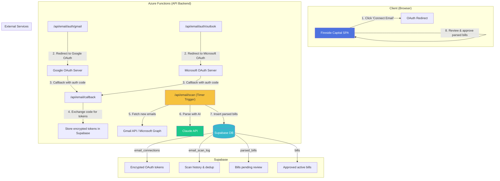
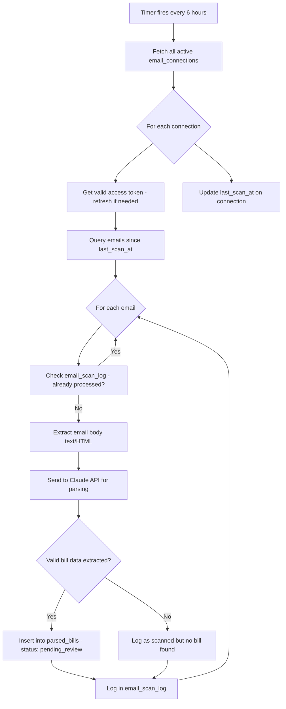
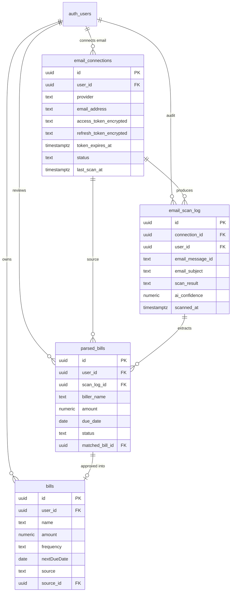

# Email-Based Bill Import — Architecture Document

> **Author:** Architect Agent  
> **Date:** July 22, 2025  
> **Status:** Draft — Pending Founder Approval  
> **Roadmap Item:** #2 — Email Integration

---

## Table of Contents

1. [Executive Summary](#1-executive-summary)
2. [System Diagram](#2-system-diagram)
3. [Email Connection Flow (OAuth)](#3-email-connection-flow-oauth)
4. [Email Scanning Pipeline](#4-email-scanning-pipeline)
5. [Bill Parsing with AI](#5-bill-parsing-with-ai)
6. [Database Schema Changes](#6-database-schema-changes)
7. [Security Considerations](#7-security-considerations)
8. [Recommended Libraries & APIs](#8-recommended-libraries--apis)
9. [Implementation Phases](#9-implementation-phases)
10. [SQL Migration Scripts](#10-sql-migration-scripts)
11. [Decision Log](#11-decision-log)

---

## 1. Executive Summary

This feature allows users to connect their Gmail or Outlook email account to Fireside Capital. Once connected, we automatically scan for bill-related emails (utility statements, subscription receipts, payment confirmations), extract financial data using Claude AI, and import it into the `bills` table.

### Key Design Principles

- **Minimal email data retention** — We store extracted financial facts, not email content
- **Server-side token handling** — OAuth tokens never touch the browser after initial redirect
- **Polling over push** — Simpler, cheaper, and sufficient for bill detection (bills aren't time-critical to the second)
- **Human-in-the-loop** — Parsed bills go to a "review" state before becoming active bills
- **Existing stack compatibility** — Uses Azure Functions (bundled free with Azure Static Web Apps) + Supabase

---

## 2. System Diagram



### Data Flow Summary

```
User clicks "Connect Email"
  → Azure Function initiates OAuth
  → Google/Microsoft redirects back with auth code
  → Azure Function exchanges code for access + refresh tokens
  → Tokens stored encrypted in `email_connections` table
  → Timer-triggered Azure Function runs every 6 hours
  → Fetches new emails matching bill patterns
  → Sends email text to Claude API for structured extraction
  → Parsed data inserted into `parsed_bills` (status: 'pending_review')
  → User reviews in dashboard, approves → copied to `bills` table
```

---

## 3. Email Connection Flow (OAuth)

### 3.1 Why Azure Functions?

| Option | Pros | Cons | Verdict |
|--------|------|------|---------|
| **Azure Functions** | Free tier with Static Web Apps; native Azure integration; can hold secrets; supports timer triggers | Separate deployment concern | ✅ **Selected** |
| Supabase Edge Functions | Same ecosystem; Deno-based | Limited timer support; no native OAuth redirect handling; cold starts; 50ms CPU limit on free tier | ❌ |
| Client-side only | Simplest | Cannot securely store refresh tokens; CORS issues; no background scanning | ❌ |
| Extend existing Express server | Already exists for Plaid | Runs on port 3000 locally; not deployed; no timer triggers | ❌ |

### 3.2 OAuth Flow: Gmail (Google API)

**Scopes Required:**
```
https://www.googleapis.com/auth/gmail.readonly
```

> We request `gmail.readonly` — the minimum scope to read email content. We do NOT request `gmail.modify`, `gmail.compose`, or full access.

**Flow:**

1. **User clicks "Connect Gmail"** in the Fireside Capital settings page
2. **Frontend redirects** to: `GET /api/email/auth/gmail?user_id={supabase_user_id}`
3. **Azure Function** builds the Google OAuth URL:
   ```
   https://accounts.google.com/o/oauth2/v2/auth?
     client_id={GOOGLE_CLIENT_ID}&
     redirect_uri={APP_URL}/api/email/callback&
     response_type=code&
     scope=https://www.googleapis.com/auth/gmail.readonly&
     access_type=offline&
     prompt=consent&
     state={encrypted_user_id}
   ```
4. **User authorizes** in Google's consent screen
5. **Google redirects** to `/api/email/callback?code={auth_code}&state={encrypted_user_id}`
6. **Azure Function** exchanges `code` for `access_token` + `refresh_token`
7. **Tokens encrypted** (AES-256-GCM) and stored in `email_connections` table
8. **User redirected** back to settings page with `?email_connected=gmail`

### 3.3 OAuth Flow: Outlook (Microsoft Graph)

**Scopes Required:**
```
Mail.Read offline_access
```

**Flow:** Same as Gmail but using Microsoft Identity Platform:

```
https://login.microsoftonline.com/common/oauth2/v2.0/authorize?
  client_id={MS_CLIENT_ID}&
  redirect_uri={APP_URL}/api/email/callback&
  response_type=code&
  scope=Mail.Read offline_access&
  state={encrypted_user_id_and_provider}
```

### 3.4 Token Storage & Refresh Strategy

```
┌─────────────────────────────────────────────────┐
│ email_connections table                         │
│                                                 │
│  access_token:  AES-256-GCM encrypted          │
│  refresh_token: AES-256-GCM encrypted          │
│  token_expires_at: timestamp                    │
│  encryption_key: Azure Key Vault (never in DB)  │
└─────────────────────────────────────────────────┘
```

**Refresh Logic (in Azure Function):**
```javascript
async function getValidAccessToken(connection) {
  if (connection.token_expires_at > Date.now() + 60000) {
    return decrypt(connection.access_token);
  }
  
  // Token expired or expiring within 60s — refresh it
  const newTokens = await refreshOAuthToken(
    connection.provider,
    decrypt(connection.refresh_token)
  );
  
  // Update stored tokens
  await supabase.from('email_connections').update({
    access_token: encrypt(newTokens.access_token),
    refresh_token: encrypt(newTokens.refresh_token), // Google rotates these
    token_expires_at: new Date(Date.now() + newTokens.expires_in * 1000)
  }).eq('id', connection.id);
  
  return newTokens.access_token;
}
```

### 3.5 Required Credentials

| Service | Credential | Storage Location | How to Obtain |
|---------|------------|-----------------|---------------|
| Google API | `GOOGLE_CLIENT_ID` | Azure Function App Settings | Google Cloud Console → APIs & Services → Credentials |
| Google API | `GOOGLE_CLIENT_SECRET` | Azure Key Vault | Same as above |
| Microsoft | `MS_CLIENT_ID` | Azure Function App Settings | Azure Portal → App Registrations |
| Microsoft | `MS_CLIENT_SECRET` | Azure Key Vault | Same as above |
| Encryption | `TOKEN_ENCRYPTION_KEY` | Azure Key Vault | Generate 256-bit key |
| Claude | `ANTHROPIC_API_KEY` | Azure Key Vault | Anthropic Console |

---

## 4. Email Scanning Pipeline

### 4.1 Architecture: Timer-Triggered Polling

**Decision: Polling every 6 hours** (not real-time push)

| Approach | Complexity | Cost | Latency | Reliability |
|----------|-----------|------|---------|-------------|
| **Timer polling (6hr)** | Low | Free tier | 6hr max | High — simple retry logic | 
| Google Pub/Sub + MS webhooks | High | ~$5/mo | Real-time | Medium — webhook delivery issues |
| User-triggered manual scan | Lowest | Free | On-demand | High |

**Rationale:** Bills arrive days before they're due. 6-hour latency is perfectly acceptable. Polling is dramatically simpler than maintaining webhook subscriptions, especially across two email providers.

### 4.2 Email Search Queries

**Gmail API query:**
```
from:(noreply OR billing OR invoice OR statement OR payment) 
subject:(bill OR invoice OR statement OR payment OR receipt OR due) 
newer_than:7d
-category:promotions
```

**Microsoft Graph filter:**
```
receivedDateTime ge {last_scan_date} and (
  contains(subject, 'bill') or 
  contains(subject, 'invoice') or 
  contains(subject, 'statement') or 
  contains(subject, 'payment due') or
  contains(subject, 'receipt') or
  contains(from/emailAddress/address, 'noreply') or
  contains(from/emailAddress/address, 'billing')
)
```

### 4.3 Scanning Pipeline (Azure Function — Timer Trigger)



### 4.4 Rate Limiting & Quotas

| Provider | Quota | Our Usage | Buffer |
|----------|-------|-----------|--------|
| Gmail API | 250 quota units/sec, 1B/day | ~50 emails/scan × 4 scans/day = 200 reads | Massive headroom |
| Microsoft Graph | 10,000 requests/10min | ~50 emails/scan × 4 scans/day = 200 | Massive headroom |
| Claude API | Pay-per-token | ~500 tokens/email × 50 emails = 25K tokens/scan | ~$0.02/scan |

### 4.5 Known Sender Patterns (Optimization)

To reduce Claude API costs, we maintain a known-sender lookup that can extract data with regex before falling back to AI:

```javascript
const KNOWN_BILLERS = {
  'noreply@peoples-gas.com': {
    name: "People's Gas",
    type: 'Utility',
    amountRegex: /Total Amount Due:\s*\$?([\d,]+\.\d{2})/,
    dueDateRegex: /Due Date:\s*(\w+ \d{1,2}, \d{4})/
  },
  'billing@verizon.com': {
    name: 'Verizon Wireless',
    type: 'Other',
    amountRegex: /Total Due:\s*\$?([\d,]+\.\d{2})/,
    dueDateRegex: /Payment Due:\s*(\d{2}\/\d{2}\/\d{4})/
  }
  // ... extend as patterns are learned
};
```

If regex extraction succeeds with high confidence, skip Claude API call. If not, fall back to AI parsing.

---

## 5. Bill Parsing with AI

### 5.1 Claude API Integration

**Model:** `claude-sonnet-4-20250514` (best cost/quality for structured extraction)

**System Prompt:**
```
You are a financial data extraction assistant. Given the text content 
of an email, extract bill/payment information and return it as JSON.

Return ONLY valid JSON in this exact format:
{
  "is_bill": true/false,
  "confidence": 0.0-1.0,
  "bills": [
    {
      "biller_name": "string",
      "amount": number,
      "due_date": "YYYY-MM-DD" or null,
      "bill_type": "Utility" | "Subscription" | "Insurance" | "Other",
      "frequency": "Monthly" | "Quarterly" | "Annually" | "One-time",
      "account_number_last4": "string" or null,
      "is_payment_confirmation": true/false
    }
  ]
}

Rules:
- If the email is not a bill or payment receipt, set is_bill to false
- Amount should be the total due, not individual line items
- Confidence below 0.6 means you're guessing — flag it
- For payment confirmations, still extract the data but flag is_payment_confirmation
- Never fabricate data — if you can't find a field, use null
```

**User Prompt:**
```
Extract bill information from this email:

From: {sender}
Subject: {subject}
Date: {received_date}

Body:
{email_body_text}
```

### 5.2 Handling Edge Cases

| Edge Case | Strategy |
|-----------|----------|
| **PDF attachments** | Phase 2 — download PDF, extract text with `pdf-parse`, send to Claude |
| **Image-based bills** | Phase 3 — use Claude's vision capability on attached images |
| **Multi-bill emails** | Claude prompt handles arrays; `bills` is an array in the response |
| **Payment confirmations** | Flag `is_payment_confirmation: true`; update existing bill's status instead of creating new |
| **Foreign currency** | Detect currency symbol; store with currency code; convert for display |
| **Duplicate emails** | Deduplicate by `email_message_id` in `email_scan_log` |
| **Newsletter/promo** | Gmail query filters out promotions; Claude's `is_bill` flag catches the rest |
| **Garbled HTML** | Strip HTML tags, decode entities before sending to Claude |

### 5.3 Email Body Preprocessing

```javascript
function preprocessEmailBody(htmlOrText, maxChars = 4000) {
  // 1. Strip HTML tags
  let text = htmlOrText.replace(/<style[^>]*>.*?<\/style>/gis, '');
  text = text.replace(/<script[^>]*>.*?<\/script>/gis, '');
  text = text.replace(/<[^>]+>/g, ' ');
  
  // 2. Decode HTML entities
  text = text.replace(/&amp;/g, '&')
             .replace(/&lt;/g, '<')
             .replace(/&gt;/g, '>')
             .replace(/&nbsp;/g, ' ')
             .replace(/&#\d+;/g, '');
  
  // 3. Collapse whitespace
  text = text.replace(/\s+/g, ' ').trim();
  
  // 4. Truncate to save tokens (most bill data is in the first 4000 chars)
  return text.substring(0, maxChars);
}
```

### 5.4 Cost Estimation

| Component | Per Email | Per Day (est. 10 new bill emails) | Per Month |
|-----------|-----------|-----------------------------------|-----------|
| Claude API (input) | ~500 tokens × $3/M = $0.0015 | $0.015 | $0.45 |
| Claude API (output) | ~200 tokens × $15/M = $0.003 | $0.03 | $0.90 |
| Gmail/Graph API | Free | Free | Free |
| Azure Functions | Free tier | Free | Free |
| **Total** | ~$0.005 | ~$0.05 | **~$1.35** |

---

## 6. Database Schema Changes

### 6.1 New Tables

#### `email_connections` — Stores OAuth credentials per user per provider

| Column | Type | Description |
|--------|------|-------------|
| `id` | `uuid` PK | Connection ID |
| `user_id` | `uuid` FK → auth.users | Owner |
| `provider` | `text` | 'gmail' or 'outlook' |
| `email_address` | `text` | Connected email address |
| `access_token_encrypted` | `text` | AES-256-GCM encrypted access token |
| `refresh_token_encrypted` | `text` | AES-256-GCM encrypted refresh token |
| `token_expires_at` | `timestamptz` | When the access token expires |
| `scopes` | `text` | Granted OAuth scopes |
| `status` | `text` | 'active', 'expired', 'revoked', 'error' |
| `last_scan_at` | `timestamptz` | Last successful scan timestamp |
| `last_error` | `text` | Last error message (if any) |
| `created_at` | `timestamptz` | When connected |
| `updated_at` | `timestamptz` | Last modified |

#### `email_scan_log` — Deduplication & audit trail for processed emails

| Column | Type | Description |
|--------|------|-------------|
| `id` | `uuid` PK | Log entry ID |
| `connection_id` | `uuid` FK → email_connections | Which connection |
| `user_id` | `uuid` FK → auth.users | Owner |
| `email_message_id` | `text` | Provider's unique message ID (for dedup) |
| `email_subject` | `text` | Subject line (for debugging) |
| `email_sender` | `text` | From address |
| `email_received_at` | `timestamptz` | When the email was received |
| `scan_result` | `text` | 'bill_found', 'not_a_bill', 'parse_error', 'skipped_duplicate' |
| `ai_confidence` | `numeric` | Claude's confidence score |
| `tokens_used` | `integer` | Claude API tokens consumed |
| `scanned_at` | `timestamptz` | When we processed this email |

#### `parsed_bills` — Bills extracted from email, pending user review

| Column | Type | Description |
|--------|------|-------------|
| `id` | `uuid` PK | Parsed bill ID |
| `user_id` | `uuid` FK → auth.users | Owner |
| `scan_log_id` | `uuid` FK → email_scan_log | Which scan produced this |
| `connection_id` | `uuid` FK → email_connections | Which email connection |
| `biller_name` | `text` | Extracted biller name |
| `amount` | `numeric` | Extracted amount |
| `due_date` | `date` | Extracted due date |
| `bill_type` | `text` | Extracted category |
| `frequency` | `text` | Detected frequency |
| `is_payment_confirmation` | `boolean` | Was this a receipt vs. a bill |
| `ai_confidence` | `numeric` | How confident the AI was |
| `raw_extraction` | `jsonb` | Full Claude API response (for debugging) |
| `status` | `text` | 'pending_review', 'approved', 'rejected', 'merged' |
| `matched_bill_id` | `uuid` FK → bills | If matched to existing bill |
| `reviewed_at` | `timestamptz` | When user reviewed |
| `created_at` | `timestamptz` | When parsed |

### 6.2 Changes to Existing `bills` Table

**Add columns to `bills`:**

| Column | Type | Default | Description |
|--------|------|---------|-------------|
| `source` | `text` | 'manual' | 'manual', 'email_import', 'plaid' |
| `source_id` | `uuid` | null | FK to parsed_bills.id if imported |
| `last_email_update` | `timestamptz` | null | Last time email scan updated this bill |
| `auto_update_enabled` | `boolean` | true | Whether to auto-update amount from future emails |

### 6.3 Entity Relationship Diagram



---

## 7. Security Considerations

### 7.1 OAuth Token Security

| Concern | Mitigation |
|---------|-----------|
| Token at rest | AES-256-GCM encryption; key in Azure Key Vault, never in database |
| Token in transit | HTTPS everywhere; tokens never sent to browser |
| Token leakage | Tokens only decrypted inside Azure Functions at scan time |
| Token revocation | Users can disconnect at any time; we immediately delete tokens |
| Refresh token rotation | Google rotates refresh tokens; we always store the latest |

### 7.2 Email Data Minimization

**What we store:**
- Email message ID (for deduplication)
- Subject line (for audit/debugging)
- Sender address (for pattern matching)
- Received timestamp
- Extracted financial data (amount, due date, biller name)

**What we NEVER store:**
- Full email body/HTML
- Email attachments (processed in memory only)
- Email recipients or CC lists
- Email thread/conversation data
- Any non-financial email content

### 7.3 Row-Level Security (RLS)

All new tables enforce the same RLS pattern as existing tables:

```sql
-- Users can only see their own email connections and parsed bills
CREATE POLICY "Users access own data" ON email_connections
  FOR ALL USING (auth.uid() = user_id) WITH CHECK (auth.uid() = user_id);
```

### 7.4 Azure Function Security

- Functions use a **service role key** (not the anon key) to write to Supabase
- Service role key stored in Azure Key Vault, referenced via App Settings
- Functions validate the `state` parameter in OAuth callbacks to prevent CSRF
- OAuth `state` includes an HMAC signature to prevent tampering

### 7.5 Scope Minimization

| Provider | Scope | Access Level |
|----------|-------|-------------|
| Gmail | `gmail.readonly` | Read-only; cannot send, modify, or delete emails |
| Microsoft | `Mail.Read` | Read-only; cannot send, modify, or delete emails |

---

## 8. Recommended Libraries & APIs

### Azure Functions (Node.js 20)

| Library | Version | Purpose |
|---------|---------|---------|
| `@azure/functions` | ^4.0 | Azure Functions SDK |
| `@azure/keyvault-secrets` | ^4.8 | Retrieve encryption keys from Key Vault |
| `@azure/identity` | ^4.0 | Managed identity auth for Key Vault |
| `googleapis` | ^130.0 | Gmail API client |
| `@microsoft/microsoft-graph-client` | ^3.0 | Microsoft Graph API client |
| `@anthropic-ai/sdk` | ^0.30 | Claude API client |
| `@supabase/supabase-js` | ^2.0 | Supabase client (service role) |
| `node:crypto` | built-in | AES-256-GCM encryption |

### Frontend (existing vanilla JS stack)

No new libraries needed. The email settings UI uses existing Bootstrap 5 modals and the Supabase JS client already in the app.

### Google Cloud Console Setup

1. Create project (or use existing)
2. Enable Gmail API
3. Create OAuth 2.0 Client ID (Web application)
4. Set authorized redirect URI: `https://{app-domain}/api/email/callback`
5. Configure OAuth consent screen (external, limited to `gmail.readonly`)

### Azure App Registration (for Microsoft)

1. Go to Azure Portal → App Registrations → New Registration
2. Set redirect URI: `https://{app-domain}/api/email/callback`
3. Under API Permissions, add `Mail.Read` (delegated)
4. Create a client secret

---

## 9. Implementation Phases

### Phase 1: Foundation (Estimated: 2-3 days) — Complexity: 🟡 Medium

**Goal:** Gmail OAuth connection + basic email scanning + manual trigger

- [ ] Set up Azure Functions project in repo (`api/` directory)
- [ ] Create `email_connections`, `email_scan_log`, `parsed_bills` tables
- [ ] Add columns to `bills` table (`source`, `source_id`, etc.)
- [ ] RLS policies for all new tables
- [ ] Google Cloud Console: Create OAuth credentials
- [ ] Implement Gmail OAuth flow (auth + callback functions)
- [ ] Token encryption/decryption utilities
- [ ] Basic email fetching (just log subjects, no parsing yet)
- [ ] Settings page UI: "Connect Gmail" button + connection status display

**Deliverables:** User can connect Gmail; we can read their email subjects.

### Phase 2: AI Parsing & Review UI (Estimated: 3-4 days) — Complexity: 🔴 High

**Goal:** Claude-powered bill extraction + user review workflow

- [ ] Email body preprocessing (HTML strip, truncate)
- [ ] Known-sender regex patterns (People's Gas, Verizon, etc.)
- [ ] Claude API integration for unknown senders
- [ ] Parsed bill insertion with confidence scores
- [ ] Review UI on bills page: pending imports card
- [ ] Approve/reject/edit workflow
- [ ] Auto-matching: detect if parsed bill matches an existing bill
- [ ] Timer trigger: scan every 6 hours

**Deliverables:** Bills automatically extracted from email; user reviews before import.

### Phase 3: Outlook + Polish (Estimated: 2-3 days) — Complexity: 🟡 Medium

**Goal:** Microsoft Graph integration + UX improvements

- [ ] Azure App Registration for Microsoft
- [ ] Outlook OAuth flow (reuses same callback pattern)
- [ ] Microsoft Graph email reading
- [ ] Settings page: "Connect Outlook" button
- [ ] Disconnect email functionality
- [ ] Connection health monitoring (detect expired/revoked tokens)
- [ ] Error state handling in UI

**Deliverables:** Full Gmail + Outlook support.

### Phase 4: Smart Features (Estimated: 2-3 days) — Complexity: 🟡 Medium

**Goal:** Automation and intelligence

- [ ] Auto-update existing bills when new email arrives with updated amount
- [ ] PDF attachment parsing (using `pdf-parse` library)
- [ ] Learn from user corrections: update known-sender patterns
- [ ] Bill amount change detection & alerts
- [ ] Scan history view (show what was scanned and when)
- [ ] Bulk approve/reject for multiple parsed bills

**Deliverables:** Increasingly automated bill management.

### Phase 5: Advanced (Future) — Complexity: 🔴 High

- [ ] Image-based bill parsing (Claude Vision)
- [ ] Real-time push notifications via Google Pub/Sub
- [ ] Multi-user household: shared bill detection
- [ ] Bill prediction: estimate next bill amount from historical pattern
- [ ] Auto-pay reminder integration

### Total Estimated Timeline

| Phase | Duration | Cumulative |
|-------|----------|-----------|
| Phase 1 | 2-3 days | 2-3 days |
| Phase 2 | 3-4 days | 5-7 days |
| Phase 3 | 2-3 days | 7-10 days |
| Phase 4 | 2-3 days | 9-13 days |

**MVP (Phases 1-2): ~1 week** to have Gmail bills auto-importing with user review.

---

## 10. SQL Migration Scripts

### Migration 001: Create email integration tables

```sql
-- ============================================================
-- Migration 001: Email Integration Tables
-- Fireside Capital — Email-Based Bill Import
-- Date: 2025-07-22
-- ============================================================

-- ========================
-- TABLE: email_connections
-- OAuth credentials for connected email accounts
-- ========================
CREATE TABLE public.email_connections (
    id uuid DEFAULT gen_random_uuid() NOT NULL,
    user_id uuid NOT NULL,
    provider text NOT NULL CHECK (provider IN ('gmail', 'outlook')),
    email_address text NOT NULL,
    access_token_encrypted text NOT NULL,
    refresh_token_encrypted text NOT NULL,
    token_expires_at timestamp with time zone NOT NULL,
    scopes text,
    status text NOT NULL DEFAULT 'active' CHECK (status IN ('active', 'expired', 'revoked', 'error')),
    last_scan_at timestamp with time zone,
    last_error text,
    created_at timestamp with time zone DEFAULT now(),
    updated_at timestamp with time zone DEFAULT now(),
    CONSTRAINT email_connections_pkey PRIMARY KEY (id),
    CONSTRAINT email_connections_user_provider_email_unique UNIQUE (user_id, provider, email_address)
);

-- Foreign key to auth.users
ALTER TABLE public.email_connections 
    ADD CONSTRAINT email_connections_user_id_fkey 
    FOREIGN KEY (user_id) REFERENCES auth.users(id) ON DELETE CASCADE;

-- Index for scanning (fetch active connections)
CREATE INDEX idx_email_connections_status ON public.email_connections (status) WHERE status = 'active';
CREATE INDEX idx_email_connections_user_id ON public.email_connections (user_id);

-- ========================
-- TABLE: email_scan_log
-- Audit trail for processed emails (dedup + debugging)
-- ========================
CREATE TABLE public.email_scan_log (
    id uuid DEFAULT gen_random_uuid() NOT NULL,
    connection_id uuid NOT NULL,
    user_id uuid NOT NULL,
    email_message_id text NOT NULL,
    email_subject text,
    email_sender text,
    email_received_at timestamp with time zone,
    scan_result text NOT NULL CHECK (scan_result IN ('bill_found', 'not_a_bill', 'parse_error', 'skipped_duplicate')),
    ai_confidence numeric,
    tokens_used integer DEFAULT 0,
    scanned_at timestamp with time zone DEFAULT now(),
    CONSTRAINT email_scan_log_pkey PRIMARY KEY (id),
    CONSTRAINT email_scan_log_message_unique UNIQUE (connection_id, email_message_id)
);

-- Foreign keys
ALTER TABLE public.email_scan_log 
    ADD CONSTRAINT email_scan_log_connection_id_fkey 
    FOREIGN KEY (connection_id) REFERENCES public.email_connections(id) ON DELETE CASCADE;
ALTER TABLE public.email_scan_log 
    ADD CONSTRAINT email_scan_log_user_id_fkey 
    FOREIGN KEY (user_id) REFERENCES auth.users(id) ON DELETE CASCADE;

-- Index for dedup lookups
CREATE INDEX idx_email_scan_log_message_id ON public.email_scan_log (connection_id, email_message_id);
CREATE INDEX idx_email_scan_log_user_id ON public.email_scan_log (user_id);

-- ========================
-- TABLE: parsed_bills
-- Bills extracted from email, pending user review
-- ========================
CREATE TABLE public.parsed_bills (
    id uuid DEFAULT gen_random_uuid() NOT NULL,
    user_id uuid NOT NULL,
    scan_log_id uuid NOT NULL,
    connection_id uuid NOT NULL,
    biller_name text NOT NULL,
    amount numeric NOT NULL,
    due_date date,
    bill_type text DEFAULT 'Other',
    frequency text DEFAULT 'Monthly',
    is_payment_confirmation boolean DEFAULT false,
    ai_confidence numeric,
    raw_extraction jsonb,
    status text NOT NULL DEFAULT 'pending_review' CHECK (status IN ('pending_review', 'approved', 'rejected', 'merged')),
    matched_bill_id uuid,
    reviewed_at timestamp with time zone,
    created_at timestamp with time zone DEFAULT now(),
    CONSTRAINT parsed_bills_pkey PRIMARY KEY (id)
);

-- Foreign keys
ALTER TABLE public.parsed_bills 
    ADD CONSTRAINT parsed_bills_user_id_fkey 
    FOREIGN KEY (user_id) REFERENCES auth.users(id) ON DELETE CASCADE;
ALTER TABLE public.parsed_bills 
    ADD CONSTRAINT parsed_bills_scan_log_id_fkey 
    FOREIGN KEY (scan_log_id) REFERENCES public.email_scan_log(id) ON DELETE CASCADE;
ALTER TABLE public.parsed_bills 
    ADD CONSTRAINT parsed_bills_connection_id_fkey 
    FOREIGN KEY (connection_id) REFERENCES public.email_connections(id) ON DELETE CASCADE;
ALTER TABLE public.parsed_bills 
    ADD CONSTRAINT parsed_bills_matched_bill_id_fkey 
    FOREIGN KEY (matched_bill_id) REFERENCES public.bills(id) ON DELETE SET NULL;

-- Indexes
CREATE INDEX idx_parsed_bills_user_status ON public.parsed_bills (user_id, status);
CREATE INDEX idx_parsed_bills_user_id ON public.parsed_bills (user_id);

-- ========================
-- ALTER TABLE: bills
-- Add source tracking columns
-- ========================
ALTER TABLE public.bills 
    ADD COLUMN IF NOT EXISTS source text DEFAULT 'manual' CHECK (source IN ('manual', 'email_import', 'plaid'));
ALTER TABLE public.bills 
    ADD COLUMN IF NOT EXISTS source_id uuid;
ALTER TABLE public.bills 
    ADD COLUMN IF NOT EXISTS last_email_update timestamp with time zone;
ALTER TABLE public.bills 
    ADD COLUMN IF NOT EXISTS auto_update_enabled boolean DEFAULT true;

-- Foreign key from bills.source_id → parsed_bills.id
ALTER TABLE public.bills 
    ADD CONSTRAINT bills_source_id_fkey 
    FOREIGN KEY (source_id) REFERENCES public.parsed_bills(id) ON DELETE SET NULL;

-- ========================
-- ROW-LEVEL SECURITY
-- ========================
ALTER TABLE public.email_connections ENABLE ROW LEVEL SECURITY;
ALTER TABLE public.email_scan_log ENABLE ROW LEVEL SECURITY;
ALTER TABLE public.parsed_bills ENABLE ROW LEVEL SECURITY;

-- email_connections: users access their own connections only
CREATE POLICY "Enable all access for users based on user_id" 
    ON public.email_connections 
    FOR ALL 
    USING (auth.uid() = user_id) 
    WITH CHECK (auth.uid() = user_id);

-- email_scan_log: users see their own scan history
CREATE POLICY "Enable all access for users based on user_id" 
    ON public.email_scan_log 
    FOR ALL 
    USING (auth.uid() = user_id) 
    WITH CHECK (auth.uid() = user_id);

-- parsed_bills: users review their own parsed bills
CREATE POLICY "Enable all access for users based on user_id" 
    ON public.parsed_bills 
    FOR ALL 
    USING (auth.uid() = user_id) 
    WITH CHECK (auth.uid() = user_id);

-- ========================
-- SERVICE ROLE POLICY
-- Azure Functions need to read/write using the service role key.
-- Supabase service role bypasses RLS by default, so no
-- additional policy is needed for the backend scanner.
-- ========================

-- ========================
-- FUNCTION: Auto-update updated_at on email_connections
-- ========================
CREATE OR REPLACE FUNCTION update_updated_at_column()
RETURNS TRIGGER AS $$
BEGIN
    NEW.updated_at = now();
    RETURN NEW;
END;
$$ LANGUAGE plpgsql;

CREATE TRIGGER set_updated_at
    BEFORE UPDATE ON public.email_connections
    FOR EACH ROW
    EXECUTE FUNCTION update_updated_at_column();
```

### Migration 002: Backfill existing bills as manual source

```sql
-- ============================================================
-- Migration 002: Backfill source on existing bills
-- Safe to run multiple times (idempotent)
-- ============================================================

UPDATE public.bills 
SET source = 'manual' 
WHERE source IS NULL;
```

---

## 11. Decision Log

| # | Decision | Rationale | Alternatives Considered |
|---|----------|-----------|------------------------|
| 1 | **Azure Functions** for backend processing | Free with Azure Static Web Apps; supports timer triggers; can hold secrets | Supabase Edge Functions (limited timers), extending Express server (not deployed) |
| 2 | **Polling every 6 hours** over real-time push | Bills aren't time-critical; dramatically simpler than webhooks; free tier friendly | Google Pub/Sub + MS webhooks (complex, $5/mo) |
| 3 | **AES-256-GCM encryption** for tokens | Industry standard; key stored in Azure Key Vault; decrypted only in Functions | Supabase Vault (beta), pg_crypto (key management harder) |
| 4 | **Human-in-the-loop review** | Financial data accuracy is critical; prevents wrong bills from entering the system | Full automation (risky), AI-only with high threshold (still risky) |
| 5 | **Separate `parsed_bills` table** | Clean separation of concerns; audit trail; allows review workflow | Insert directly into `bills` with a flag (messy), separate approval column (limited) |
| 6 | **Claude claude-sonnet-4-20250514** for parsing | Best cost/quality ratio for structured extraction; ~$1.35/month | GPT-4o (similar cost, less reliable JSON), regex-only (too fragile) |
| 7 | **Known-sender regex first, AI fallback** | Saves ~60% of API costs for common billers; faster for known patterns | Always use AI (simpler but more expensive), only regex (too limited) |
| 8 | **Gmail readonly scope** | Minimum necessary access; builds user trust | Full Gmail access (unnecessary, scary consent screen) |
| 9 | **Add `source` column to existing `bills`** | Track provenance without breaking existing data; enables mixed manual+auto | Separate table for imported bills (fragmented), no tracking (lose auditability) |
| 10 | **Gmail first, Outlook second** | Gmail has simpler API; more common for personal email; validates the architecture | Both simultaneously (doubles Phase 1 scope), Outlook first (less common) |

---

## Appendix A: Azure Functions Directory Structure

```
api/
├── package.json
├── host.json
├── local.settings.json          # Local dev secrets (git-ignored)
├── src/
│   ├── functions/
│   │   ├── emailAuthGmail.js    # GET /api/email/auth/gmail
│   │   ├── emailAuthOutlook.js  # GET /api/email/auth/outlook
│   │   ├── emailCallback.js     # GET /api/email/callback
│   │   ├── emailScanTimer.js    # Timer trigger (every 6 hours)
│   │   ├── emailScanManual.js   # POST /api/email/scan (manual trigger)
│   │   ├── emailDisconnect.js   # POST /api/email/disconnect
│   │   └── parsedBillAction.js  # POST /api/parsed-bills/:id/approve|reject
│   ├── lib/
│   │   ├── crypto.js            # AES-256-GCM encrypt/decrypt
│   │   ├── gmail.js             # Gmail API wrapper
│   │   ├── outlook.js           # Microsoft Graph wrapper
│   │   ├── parser.js            # Claude AI parsing
│   │   ├── knownSenders.js      # Regex patterns for known billers
│   │   ├── supabase.js          # Supabase service role client
│   │   └── tokenManager.js      # Token refresh logic
│   └── types/
│       └── index.d.ts           # TypeScript declarations (if needed)
└── .funcignore
```

## Appendix B: Settings Page UI Mockup

```
┌──────────────────────────────────────────────┐
│  Email Connections                            │
│                                               │
│  ┌─────────────────────────────────────────┐ │
│  │  📧 Gmail: matt@gmail.com               │ │
│  │  Status: ✅ Connected                    │ │
│  │  Last scan: 2 hours ago                  │ │
│  │  Bills found: 8                          │ │
│  │  [Scan Now]  [Disconnect]                │ │
│  └─────────────────────────────────────────┘ │
│                                               │
│  ┌─────────────────────────────────────────┐ │
│  │  📧 Outlook: Not connected              │ │
│  │  [Connect Outlook]                       │ │
│  └─────────────────────────────────────────┘ │
│                                               │
│  ─────────────────────────────────────────── │
│                                               │
│  Pending Bill Reviews (3)                     │
│                                               │
│  ┌───────────────────────────────────────┐   │
│  │ People's Gas  $92.14  Due: Aug 7      │   │
│  │ Confidence: 98%  [✅ Approve] [❌ Reject]│   │
│  ├───────────────────────────────────────┤   │
│  │ Netflix       $15.99  Due: Aug 12     │   │
│  │ Confidence: 95%  [✅ Approve] [❌ Reject]│   │
│  ├───────────────────────────────────────┤   │
│  │ Unknown Bill  $247.00  Due: Aug 15    │   │
│  │ Confidence: 62%  [✅ Approve] [✏️ Edit] [❌]│
│  └───────────────────────────────────────┘   │
└──────────────────────────────────────────────┘
```

---

*This document should be reviewed and approved before implementation begins. Key prerequisite: Google Cloud Console and Azure App Registration credentials must be created by the founder.*
