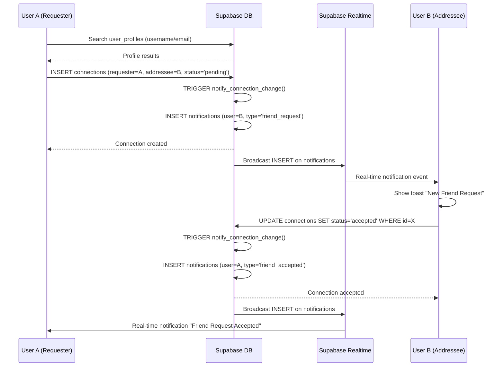
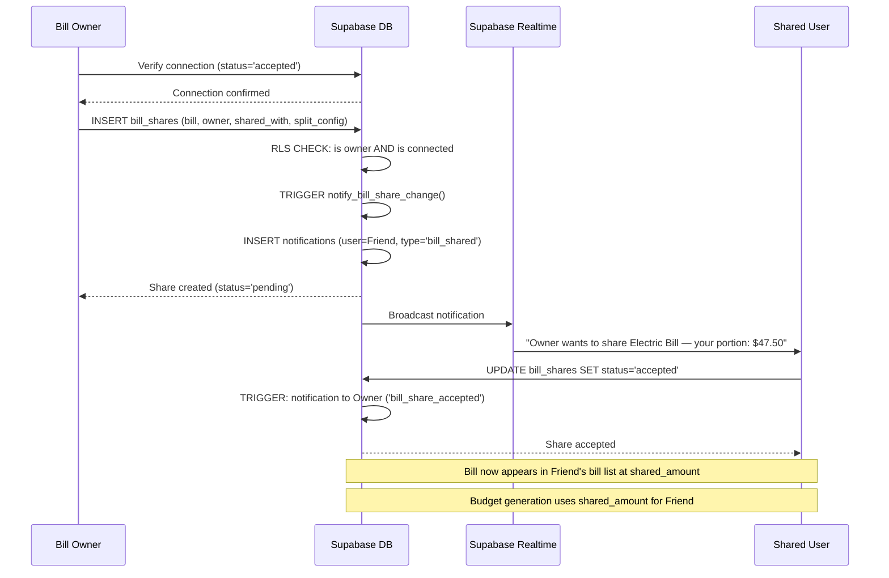
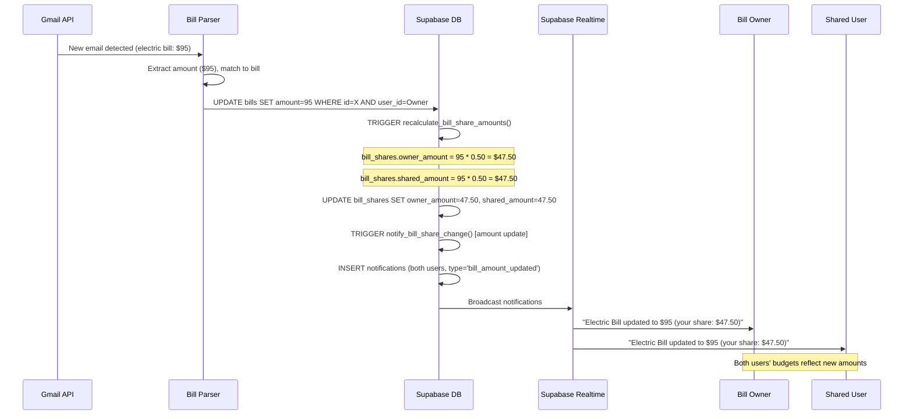

# Shared Bills & Social Connections — Architecture Document

**Author:** Architect Agent  
**Date:** 2025-07-21  
**Status:** Draft — Pending Founder Review  
**Migration:** `app/Supabase/shared-bills-migration.sql`

---

## Table of Contents

1. [Overview](#1-overview)
2. [Database Schema](#2-database-schema)
3. [Row-Level Security (RLS) Policies](#3-row-level-security-rls-policies)
4. [API / Query Patterns](#4-api--query-patterns)
5. [Notification Design](#5-notification-design)
6. [Sequence Diagrams](#6-sequence-diagrams)
7. [Budget Integration](#7-budget-integration)
8. [Email Parser Auto-Split Integration](#8-email-parser-auto-split-integration)
9. [Edge Cases](#9-edge-cases)
10. [Security Analysis](#10-security-analysis)
11. [Migration Strategy](#11-migration-strategy)

---

## 1. Overview

This feature adds **social connections** (friends) and **bill sharing** to Fireside Capital. Users can connect with friends/partners, share bills with customizable split ratios, and see their portion appear in their personal budget automatically.

### Design Principles

1. **Bill owner is source of truth** — only the owner can edit the bill; changes propagate to shared users
2. **Mutual consent everywhere** — friend requests AND bill shares require acceptance
3. **RLS-first security** — cross-user access is enabled through surgical RLS policies, never by relaxing existing ones
4. **Minimal schema intrusion** — new tables extend the system; no modifications to existing `bills` columns
5. **Budget transparency** — shared bills appear in budgets at the user's split amount with clear visual indicators

### New Tables

| Table | Purpose |
|-------|---------|
| `user_profiles` | Public-facing user info (display name, username, avatar) |
| `connections` | Friend/partner relationships with status tracking |
| `bill_shares` | Shared bill mappings with split configuration |
| `notifications` | In-app notification queue for all social events |

---

## 2. Database Schema

### 2.1 `user_profiles`

Public-facing user information. Created automatically when a user signs up (via trigger on `auth.users`). This is the only table other users can search/read (with restrictions).

```sql
CREATE TABLE public.user_profiles (
    id              uuid PRIMARY KEY REFERENCES auth.users(id) ON DELETE CASCADE,
    username        text UNIQUE,                    -- unique handle, e.g. "matt_fireside"
    display_name    text,                           -- "Matt C."
    avatar_url      text,                           -- URL to profile image (Supabase Storage)
    email_visible   boolean DEFAULT false,          -- whether email is searchable by others
    created_at      timestamptz DEFAULT now(),
    updated_at      timestamptz DEFAULT now(),

    -- Constraints
    CONSTRAINT username_format CHECK (
        username IS NULL OR (
            length(username) BETWEEN 3 AND 30
            AND username ~ '^[a-zA-Z0-9_]+$'
        )
    )
);

-- Indexes
CREATE UNIQUE INDEX idx_user_profiles_username_lower ON public.user_profiles (lower(username));
CREATE INDEX idx_user_profiles_display_name ON public.user_profiles (lower(display_name));
```

**Key decisions:**
- `id` matches `auth.users.id` — no separate UUID; this IS the user's profile
- `username` is optional at signup, can be set later in settings
- `email_visible` controls whether the user's email appears in friend searches
- Username is case-insensitive unique (via the lower() index)

### 2.2 `connections`

Tracks friend/partner relationships. Uses a directional model (requester → addressee) with a status field.

```sql
CREATE TABLE public.connections (
    id              uuid PRIMARY KEY DEFAULT gen_random_uuid(),
    requester_id    uuid NOT NULL REFERENCES auth.users(id) ON DELETE CASCADE,
    addressee_id    uuid NOT NULL REFERENCES auth.users(id) ON DELETE CASCADE,
    status          text NOT NULL DEFAULT 'pending',
    created_at      timestamptz DEFAULT now(),
    updated_at      timestamptz DEFAULT now(),

    -- Prevent duplicate requests and self-connections
    CONSTRAINT connections_no_self CHECK (requester_id != addressee_id),
    CONSTRAINT connections_unique_pair UNIQUE (requester_id, addressee_id),
    CONSTRAINT connections_status_check CHECK (status IN ('pending', 'accepted', 'declined', 'blocked'))
);

-- Indexes for efficient lookups
CREATE INDEX idx_connections_requester ON public.connections (requester_id, status);
CREATE INDEX idx_connections_addressee ON public.connections (addressee_id, status);
CREATE INDEX idx_connections_pair ON public.connections (
    LEAST(requester_id, addressee_id),
    GREATEST(requester_id, addressee_id)
);
```

**Key decisions:**
- **Directional model**: `requester_id` → `addressee_id` preserves who sent the request
- **Unique pair constraint**: prevents duplicate requests in the same direction
- **`idx_connections_pair`**: enables efficient "are these two users connected?" checks regardless of who requested
- **Status lifecycle**: `pending` → `accepted` | `declined` | `blocked`
- When a user removes a connection, the row is **deleted**, not status-changed (clean break)

### 2.3 `bill_shares`

Maps a bill to a shared user with split configuration. The bill owner does NOT have a row here — they own the bill in the `bills` table. Only the "other side" of the share gets a `bill_shares` row.

```sql
CREATE TABLE public.bill_shares (
    id              uuid PRIMARY KEY DEFAULT gen_random_uuid(),
    bill_id         uuid NOT NULL REFERENCES public.bills(id) ON DELETE CASCADE,
    owner_id        uuid NOT NULL REFERENCES auth.users(id) ON DELETE CASCADE,
    shared_with_id  uuid NOT NULL REFERENCES auth.users(id) ON DELETE CASCADE,
    status          text NOT NULL DEFAULT 'pending',
    
    -- Split configuration
    split_type      text NOT NULL DEFAULT 'percentage',  -- 'percentage', 'fixed', 'equal'
    owner_percent   numeric,          -- owner's share as percentage (e.g., 50 = 50%)
    shared_percent  numeric,          -- shared user's share as percentage
    owner_fixed     numeric,          -- owner's fixed dollar amount
    shared_fixed    numeric,          -- shared user's fixed dollar amount
    
    -- Denormalized for fast reads (updated via trigger when bill amount changes)
    owner_amount    numeric,          -- calculated: owner's actual dollar amount this period
    shared_amount   numeric,          -- calculated: shared user's actual dollar amount this period
    
    created_at      timestamptz DEFAULT now(),
    updated_at      timestamptz DEFAULT now(),
    accepted_at     timestamptz,      -- when the shared user accepted

    -- Constraints
    CONSTRAINT bill_shares_no_self CHECK (owner_id != shared_with_id),
    CONSTRAINT bill_shares_unique UNIQUE (bill_id, shared_with_id),
    CONSTRAINT bill_shares_status_check CHECK (status IN ('pending', 'accepted', 'declined', 'cancelled')),
    CONSTRAINT bill_shares_split_type_check CHECK (split_type IN ('percentage', 'fixed', 'equal')),
    CONSTRAINT bill_shares_percent_valid CHECK (
        split_type != 'percentage' OR (
            owner_percent >= 0 AND owner_percent <= 100
            AND shared_percent >= 0 AND shared_percent <= 100
            AND (owner_percent + shared_percent) BETWEEN 99.99 AND 100.01  -- allow rounding
        )
    ),
    CONSTRAINT bill_shares_fixed_valid CHECK (
        split_type != 'fixed' OR (
            owner_fixed >= 0 AND shared_fixed >= 0
        )
    )
);

-- Indexes
CREATE INDEX idx_bill_shares_bill ON public.bill_shares (bill_id);
CREATE INDEX idx_bill_shares_owner ON public.bill_shares (owner_id, status);
CREATE INDEX idx_bill_shares_shared ON public.bill_shares (shared_with_id, status);
```

**Key decisions:**

- **One share per bill**: Currently supports sharing with ONE other user (covers 95% of use cases: couples, roommates). Multi-way splitting is a future enhancement — the schema supports it by allowing multiple `bill_shares` rows per `bill_id`.
- **`owner_id` denormalized**: Stored here instead of joining through `bills.user_id` for RLS simplicity. The trigger ensures consistency.
- **Denormalized amounts (`owner_amount`, `shared_amount`)**: Recalculated whenever the bill amount or split config changes. This avoids complex joins in every query.
- **Split types**:
  - `equal`: 50/50 split (stored as percentages: 50/50)
  - `percentage`: Custom split like 60/40
  - `fixed`: Fixed dollar amounts (e.g., owner pays $60, shared pays $35 of a $95 bill)
- **Status lifecycle**: `pending` → `accepted` | `declined` | `cancelled`
  - `cancelled` = owner withdrew the share invitation

### 2.4 `notifications`

In-app notification system. Leverages Supabase Realtime for instant delivery.

```sql
CREATE TABLE public.notifications (
    id              uuid PRIMARY KEY DEFAULT gen_random_uuid(),
    user_id         uuid NOT NULL REFERENCES auth.users(id) ON DELETE CASCADE,
    type            text NOT NULL,
    title           text NOT NULL,
    body            text,
    data            jsonb DEFAULT '{}',   -- arbitrary payload (bill_id, connection_id, etc.)
    is_read         boolean DEFAULT false,
    created_at      timestamptz DEFAULT now(),

    CONSTRAINT notifications_type_check CHECK (type IN (
        'friend_request',
        'friend_accepted',
        'bill_shared',
        'bill_share_accepted',
        'bill_share_declined',
        'bill_amount_updated',
        'bill_deleted',
        'payment_reminder',
        'connection_removed'
    ))
);

-- Indexes
CREATE INDEX idx_notifications_user_unread ON public.notifications (user_id, is_read, created_at DESC);
CREATE INDEX idx_notifications_user_created ON public.notifications (user_id, created_at DESC);
```

**Key decisions:**
- **`data` as JSONB**: Flexible payload for different notification types without column bloat
- **No foreign keys on `data` contents**: The referenced bill/connection may be deleted; the notification remains as a historical record
- **Index on unread**: Optimized for the "unread count" badge query
- **Cleanup strategy**: Notifications older than 90 days can be purged via a scheduled function

### 2.5 Complete ER Diagram

```
┌──────────────┐     ┌──────────────────┐     ┌──────────────┐
│  auth.users  │────▶│  user_profiles   │     │    bills      │
│              │     │                  │     │              │
│  id (PK)     │     │  id (PK, FK)     │     │  id (PK)     │
│  email       │     │  username        │     │  user_id (FK)│
│              │     │  display_name    │     │  name        │
│              │     │  avatar_url      │     │  amount      │
│              │     │  email_visible   │     │  ...         │
└──────┬───────┘     └──────────────────┘     └──────┬───────┘
       │                                              │
       │  ┌───────────────────┐                       │
       ├──│   connections     │                       │
       │  │                   │                       │
       │  │  requester_id (FK)│──┐                    │
       │  │  addressee_id (FK)│──┘                    │
       │  │  status           │                       │
       │  └───────────────────┘                       │
       │                                              │
       │  ┌───────────────────┐                       │
       ├──│   bill_shares     │───────────────────────┘
       │  │                   │
       │  │  bill_id (FK)     │
       │  │  owner_id (FK)    │
       │  │  shared_with_id   │
       │  │  split_type       │
       │  │  owner_amount     │
       │  │  shared_amount    │
       │  │  status           │
       │  └───────────────────┘
       │
       │  ┌───────────────────┐
       └──│  notifications    │
          │                   │
          │  user_id (FK)     │
          │  type             │
          │  title / body     │
          │  data (jsonb)     │
          │  is_read          │
          └───────────────────┘
```

---

## 3. Row-Level Security (RLS) Policies

### 3.1 `user_profiles` — Searchable but Private

```sql
ALTER TABLE public.user_profiles ENABLE ROW LEVEL SECURITY;

-- Users can read/update their own profile
CREATE POLICY "Users can manage own profile"
    ON public.user_profiles FOR ALL
    USING (auth.uid() = id)
    WITH CHECK (auth.uid() = id);

-- Any authenticated user can search profiles (for friend search)
-- BUT only see: id, username, display_name, avatar_url
-- (email is never exposed here — it lives in auth.users which is not queryable)
CREATE POLICY "Authenticated users can search profiles"
    ON public.user_profiles FOR SELECT
    USING (auth.role() = 'authenticated');
```

> **Note:** The SELECT policy exposes all columns. The frontend should use `.select('id, username, display_name, avatar_url')` to limit exposure. For additional security, a Postgres VIEW could restrict visible columns, but Supabase RLS + controlled selects is sufficient here.

### 3.2 `connections` — Mutual Access

```sql
ALTER TABLE public.connections ENABLE ROW LEVEL SECURITY;

-- Users can see connections where they are either party
CREATE POLICY "Users can view own connections"
    ON public.connections FOR SELECT
    USING (auth.uid() = requester_id OR auth.uid() = addressee_id);

-- Users can send friend requests (they must be the requester)
CREATE POLICY "Users can send friend requests"
    ON public.connections FOR INSERT
    WITH CHECK (auth.uid() = requester_id);

-- Users can update connections they're part of (accept/decline/block)
CREATE POLICY "Users can update own connections"
    ON public.connections FOR UPDATE
    USING (auth.uid() = requester_id OR auth.uid() = addressee_id)
    WITH CHECK (auth.uid() = requester_id OR auth.uid() = addressee_id);

-- Users can delete connections they're part of (unfriend)
CREATE POLICY "Users can delete own connections"
    ON public.connections FOR DELETE
    USING (auth.uid() = requester_id OR auth.uid() = addressee_id);
```

### 3.3 `bill_shares` — Controlled Cross-User Access

This is the critical policy set. It enables the bill owner AND the shared user to both see the share record, while ensuring only the owner can create/modify shares.

```sql
ALTER TABLE public.bill_shares ENABLE ROW LEVEL SECURITY;

-- Both the owner and shared user can see share records they're part of
CREATE POLICY "Users can view own bill shares"
    ON public.bill_shares FOR SELECT
    USING (auth.uid() = owner_id OR auth.uid() = shared_with_id);

-- Only the bill owner can create shares
-- Additional check: must be connected to the shared user
CREATE POLICY "Bill owners can create shares"
    ON public.bill_shares FOR INSERT
    WITH CHECK (
        auth.uid() = owner_id
        AND EXISTS (
            SELECT 1 FROM public.connections
            WHERE status = 'accepted'
            AND (
                (requester_id = auth.uid() AND addressee_id = bill_shares.shared_with_id)
                OR (addressee_id = auth.uid() AND requester_id = bill_shares.shared_with_id)
            )
        )
    );

-- Owner can update split config; shared user can update status (accept/decline)
CREATE POLICY "Participants can update bill shares"
    ON public.bill_shares FOR UPDATE
    USING (auth.uid() = owner_id OR auth.uid() = shared_with_id)
    WITH CHECK (auth.uid() = owner_id OR auth.uid() = shared_with_id);

-- Only the owner can delete (cancel) a share
CREATE POLICY "Bill owners can delete shares"
    ON public.bill_shares FOR DELETE
    USING (auth.uid() = owner_id);
```

### 3.4 `bills` — Extending for Cross-User READ Access

The existing bills policy only allows `auth.uid() = user_id`. We need shared users to READ bills shared with them, **without** being able to edit them.

```sql
-- Keep the existing policy for owner CRUD
-- (Already exists: "Enable all access for users based on user_id")

-- ADD: Allow shared users to READ bills shared with them (accepted shares only)
CREATE POLICY "Shared users can read shared bills"
    ON public.bills FOR SELECT
    USING (
        auth.uid() = user_id  -- owner access (redundant with existing, but explicit)
        OR EXISTS (
            SELECT 1 FROM public.bill_shares
            WHERE bill_shares.bill_id = bills.id
            AND bill_shares.shared_with_id = auth.uid()
            AND bill_shares.status = 'accepted'
        )
    );
```

> **Important:** The existing "Enable all access for users based on user_id" policy covers SELECT for owners. This new policy ONLY adds SELECT for shared users. They cannot INSERT, UPDATE, or DELETE the bill. RLS policies are OR'd together for the same operation, so this is additive and safe.

### 3.5 `notifications` — Standard User-Only

```sql
ALTER TABLE public.notifications ENABLE ROW LEVEL SECURITY;

CREATE POLICY "Users can manage own notifications"
    ON public.notifications FOR ALL
    USING (auth.uid() = user_id)
    WITH CHECK (auth.uid() = user_id);
```

### 3.6 `budgets` — Extending for Shared Bill Budget Entries

The budget table's existing RLS (`auth.uid() = user_id`) is **already correct**. Each user's budget entries are theirs — even for shared bills, the budget entry is created under THEIR `user_id` with THEIR split amount. No cross-user access needed.

---

## 4. API / Query Patterns

### 4.1 Searching Users

```javascript
// Search by username or display name (partial match)
async function searchUsers(query) {
    const { data, error } = await sb
        .from('user_profiles')
        .select('id, username, display_name, avatar_url')
        .or(`username.ilike.%${query}%,display_name.ilike.%${query}%`)
        .neq('id', currentUser.id)  // exclude self
        .limit(20);
    return data;
}

// Search by email (if user has email_visible = true)
// This requires a server-side function since auth.users isn't directly queryable
async function searchByEmail(email) {
    const { data, error } = await sb.rpc('search_users_by_email', { 
        search_email: email 
    });
    return data;
}
```

**Server-side function for email search:**
```sql
CREATE OR REPLACE FUNCTION search_users_by_email(search_email text)
RETURNS TABLE (id uuid, username text, display_name text, avatar_url text)
LANGUAGE plpgsql
SECURITY DEFINER
AS $$
BEGIN
    RETURN QUERY
    SELECT p.id, p.username, p.display_name, p.avatar_url
    FROM public.user_profiles p
    JOIN auth.users u ON u.id = p.id
    WHERE lower(u.email) = lower(search_email)
    AND p.email_visible = true
    AND p.id != auth.uid();
END;
$$;
```

### 4.2 Friend Request Flow

```javascript
// Send a friend request
async function sendFriendRequest(addresseeId) {
    const { data, error } = await sb
        .from('connections')
        .insert({
            requester_id: currentUser.id,
            addressee_id: addresseeId,
            status: 'pending'
        });
    // Notification is created automatically via trigger
    return { data, error };
}

// Accept a friend request
async function acceptFriendRequest(connectionId) {
    const { data, error } = await sb
        .from('connections')
        .update({ status: 'accepted', updated_at: new Date().toISOString() })
        .eq('id', connectionId)
        .eq('addressee_id', currentUser.id);  // only addressee can accept
    return { data, error };
}

// Decline a friend request
async function declineFriendRequest(connectionId) {
    const { data, error } = await sb
        .from('connections')
        .update({ status: 'declined', updated_at: new Date().toISOString() })
        .eq('id', connectionId)
        .eq('addressee_id', currentUser.id);
    return { data, error };
}

// Get my connections (accepted friends)
async function getMyFriends() {
    const { data, error } = await sb
        .from('connections')
        .select(`
            id, status, created_at,
            requester:user_profiles!connections_requester_id_fkey(id, username, display_name, avatar_url),
            addressee:user_profiles!connections_addressee_id_fkey(id, username, display_name, avatar_url)
        `)
        .eq('status', 'accepted')
        .or(`requester_id.eq.${currentUser.id},addressee_id.eq.${currentUser.id}`);
    
    // Normalize: always return the "other" user
    return (data || []).map(conn => ({
        connectionId: conn.id,
        friend: conn.requester.id === currentUser.id ? conn.addressee : conn.requester,
        since: conn.created_at
    }));
}

// Get pending friend requests (received)
async function getPendingRequests() {
    const { data, error } = await sb
        .from('connections')
        .select(`
            id, created_at,
            requester:user_profiles!connections_requester_id_fkey(id, username, display_name, avatar_url)
        `)
        .eq('addressee_id', currentUser.id)
        .eq('status', 'pending');
    return data;
}

// Remove a friend
async function removeFriend(connectionId) {
    const { error } = await sb
        .from('connections')
        .delete()
        .eq('id', connectionId);
    return { error };
}
```

### 4.3 Sharing a Bill

```javascript
// Share a bill with a connected friend
async function shareBill(billId, friendId, splitType, splitConfig) {
    const bill = window.bills.find(b => b.id === billId);
    if (!bill) throw new Error('Bill not found');

    // Calculate amounts based on split type
    let owner_percent, shared_percent, owner_fixed, shared_fixed;
    let owner_amount, shared_amount;
    
    switch (splitType) {
        case 'equal':
            owner_percent = 50;
            shared_percent = 50;
            owner_amount = bill.amount / 2;
            shared_amount = bill.amount / 2;
            break;
        case 'percentage':
            owner_percent = splitConfig.ownerPercent;
            shared_percent = splitConfig.sharedPercent;
            owner_amount = bill.amount * (owner_percent / 100);
            shared_amount = bill.amount * (shared_percent / 100);
            break;
        case 'fixed':
            owner_fixed = splitConfig.ownerFixed;
            shared_fixed = splitConfig.sharedFixed;
            owner_amount = owner_fixed;
            shared_amount = shared_fixed;
            break;
    }

    const { data, error } = await sb
        .from('bill_shares')
        .insert({
            bill_id: billId,
            owner_id: currentUser.id,
            shared_with_id: friendId,
            status: 'pending',
            split_type: splitType,
            owner_percent,
            shared_percent,
            owner_fixed,
            shared_fixed,
            owner_amount: Math.round(owner_amount * 100) / 100,
            shared_amount: Math.round(shared_amount * 100) / 100
        });
    
    // Notification is created via trigger
    return { data, error };
}

// Accept a shared bill
async function acceptBillShare(shareId) {
    const { data, error } = await sb
        .from('bill_shares')
        .update({ 
            status: 'accepted', 
            accepted_at: new Date().toISOString(),
            updated_at: new Date().toISOString()
        })
        .eq('id', shareId)
        .eq('shared_with_id', currentUser.id);
    return { data, error };
}

// Decline a shared bill
async function declineBillShare(shareId) {
    const { data, error } = await sb
        .from('bill_shares')
        .update({ 
            status: 'declined',
            updated_at: new Date().toISOString()
        })
        .eq('id', shareId)
        .eq('shared_with_id', currentUser.id);
    return { data, error };
}
```

### 4.4 Fetching "My Bills" (Including Shared With Me)

This is the most important query pattern. It returns ALL bills the user needs to see: owned + shared.

```javascript
async function fetchMyBillsWithShares() {
    // 1. Fetch owned bills (existing query)
    const { data: ownedBills, error: ownErr } = await sb
        .from('bills')
        .select('*')
        .eq('user_id', currentUser.id);
    
    // 2. Fetch bill shares where I'm the owner (to show sharing indicators)
    const { data: myShares, error: shareErr } = await sb
        .from('bill_shares')
        .select(`
            *,
            shared_user:user_profiles!bill_shares_shared_with_id_fkey(
                id, username, display_name, avatar_url
            )
        `)
        .eq('owner_id', currentUser.id);
    
    // 3. Fetch bill shares where I'm the shared user (accepted only)
    const { data: sharedWithMe, error: sharedErr } = await sb
        .from('bill_shares')
        .select(`
            *,
            bill:bills!bill_shares_bill_id_fkey(*),
            owner:user_profiles!bill_shares_owner_id_fkey(
                id, username, display_name, avatar_url
            )
        `)
        .eq('shared_with_id', currentUser.id)
        .eq('status', 'accepted');
    
    // 4. Merge: annotate owned bills with share info
    const enrichedOwned = (ownedBills || []).map(bill => {
        const share = (myShares || []).find(s => s.bill_id === bill.id);
        return {
            ...bill,
            _isShared: !!share,
            _shareInfo: share ? {
                shareId: share.id,
                sharedWith: share.shared_user,
                splitType: share.split_type,
                myAmount: share.owner_amount,
                theirAmount: share.shared_amount,
                status: share.status
            } : null
        };
    });
    
    // 5. Transform shared-with-me bills into the same shape
    const sharedBills = (sharedWithMe || []).map(share => ({
        ...share.bill,
        // Override amount with MY portion
        _originalAmount: share.bill.amount,
        amount: share.shared_amount,
        _isSharedWithMe: true,
        _shareInfo: {
            shareId: share.id,
            owner: share.owner,
            splitType: share.split_type,
            myAmount: share.shared_amount,
            ownerAmount: share.owner_amount,
            status: share.status
        }
    }));
    
    return {
        owned: enrichedOwned,
        sharedWithMe: sharedBills,
        all: [...enrichedOwned, ...sharedBills]
    };
}
```

### 4.5 Updating Split Ratios

```javascript
async function updateBillSplit(shareId, newSplitType, newConfig) {
    const { data: share } = await sb
        .from('bill_shares')
        .select('*, bill:bills!bill_shares_bill_id_fkey(amount)')
        .eq('id', shareId)
        .eq('owner_id', currentUser.id)
        .single();
    
    if (!share) throw new Error('Share not found or not owner');
    
    const billAmount = share.bill.amount;
    let update = { split_type: newSplitType, updated_at: new Date().toISOString() };
    
    switch (newSplitType) {
        case 'equal':
            update.owner_percent = 50;
            update.shared_percent = 50;
            update.owner_fixed = null;
            update.shared_fixed = null;
            update.owner_amount = billAmount / 2;
            update.shared_amount = billAmount / 2;
            break;
        case 'percentage':
            update.owner_percent = newConfig.ownerPercent;
            update.shared_percent = newConfig.sharedPercent;
            update.owner_fixed = null;
            update.shared_fixed = null;
            update.owner_amount = billAmount * (newConfig.ownerPercent / 100);
            update.shared_amount = billAmount * (newConfig.sharedPercent / 100);
            break;
        case 'fixed':
            update.owner_percent = null;
            update.shared_percent = null;
            update.owner_fixed = newConfig.ownerFixed;
            update.shared_fixed = newConfig.sharedFixed;
            update.owner_amount = newConfig.ownerFixed;
            update.shared_amount = newConfig.sharedFixed;
            break;
    }
    
    const { error } = await sb
        .from('bill_shares')
        .update(update)
        .eq('id', shareId);
    
    return { error };
}
```

---

## 5. Notification Design

### 5.1 Storage

Notifications are stored in the `notifications` table (defined above). Each notification has:
- `type`: Enum for the event kind
- `title`: Human-readable headline
- `body`: Descriptive text
- `data`: JSONB payload with IDs for navigation

### 5.2 Creation — Database Triggers

Notifications are created server-side via triggers, ensuring they're always generated even if the frontend fails.

```sql
-- Trigger function: create notification on connection status change
CREATE OR REPLACE FUNCTION notify_connection_change()
RETURNS trigger
LANGUAGE plpgsql
SECURITY DEFINER
AS $$
DECLARE
    v_requester_name text;
    v_addressee_name text;
BEGIN
    SELECT COALESCE(display_name, username, 'Someone') INTO v_requester_name
    FROM public.user_profiles WHERE id = NEW.requester_id;
    
    SELECT COALESCE(display_name, username, 'Someone') INTO v_addressee_name
    FROM public.user_profiles WHERE id = NEW.addressee_id;

    -- New friend request
    IF TG_OP = 'INSERT' AND NEW.status = 'pending' THEN
        INSERT INTO public.notifications (user_id, type, title, body, data)
        VALUES (
            NEW.addressee_id,
            'friend_request',
            'New Friend Request',
            v_requester_name || ' wants to connect with you',
            jsonb_build_object('connection_id', NEW.id, 'requester_id', NEW.requester_id)
        );
    END IF;

    -- Friend request accepted
    IF TG_OP = 'UPDATE' AND OLD.status = 'pending' AND NEW.status = 'accepted' THEN
        INSERT INTO public.notifications (user_id, type, title, body, data)
        VALUES (
            NEW.requester_id,
            'friend_accepted',
            'Friend Request Accepted',
            v_addressee_name || ' accepted your friend request',
            jsonb_build_object('connection_id', NEW.id, 'addressee_id', NEW.addressee_id)
        );
    END IF;

    RETURN NEW;
END;
$$;

CREATE TRIGGER trg_connection_notifications
    AFTER INSERT OR UPDATE ON public.connections
    FOR EACH ROW
    EXECUTE FUNCTION notify_connection_change();
```

```sql
-- Trigger function: create notification on bill share events
CREATE OR REPLACE FUNCTION notify_bill_share_change()
RETURNS trigger
LANGUAGE plpgsql
SECURITY DEFINER
AS $$
DECLARE
    v_bill_name text;
    v_owner_name text;
    v_shared_name text;
BEGIN
    SELECT name INTO v_bill_name FROM public.bills WHERE id = NEW.bill_id;
    SELECT COALESCE(display_name, username, 'Someone') INTO v_owner_name
    FROM public.user_profiles WHERE id = NEW.owner_id;
    SELECT COALESCE(display_name, username, 'Someone') INTO v_shared_name
    FROM public.user_profiles WHERE id = NEW.shared_with_id;

    -- New bill share invitation
    IF TG_OP = 'INSERT' AND NEW.status = 'pending' THEN
        INSERT INTO public.notifications (user_id, type, title, body, data)
        VALUES (
            NEW.shared_with_id,
            'bill_shared',
            'Bill Shared With You',
            v_owner_name || ' wants to share "' || COALESCE(v_bill_name, 'a bill') || '" with you — your portion: $' || ROUND(NEW.shared_amount, 2),
            jsonb_build_object('share_id', NEW.id, 'bill_id', NEW.bill_id, 'owner_id', NEW.owner_id)
        );
    END IF;

    -- Bill share accepted
    IF TG_OP = 'UPDATE' AND OLD.status = 'pending' AND NEW.status = 'accepted' THEN
        INSERT INTO public.notifications (user_id, type, title, body, data)
        VALUES (
            NEW.owner_id,
            'bill_share_accepted',
            'Bill Share Accepted',
            v_shared_name || ' accepted the shared bill "' || COALESCE(v_bill_name, '') || '"',
            jsonb_build_object('share_id', NEW.id, 'bill_id', NEW.bill_id)
        );
    END IF;

    -- Bill share declined
    IF TG_OP = 'UPDATE' AND OLD.status = 'pending' AND NEW.status = 'declined' THEN
        INSERT INTO public.notifications (user_id, type, title, body, data)
        VALUES (
            NEW.owner_id,
            'bill_share_declined',
            'Bill Share Declined',
            v_shared_name || ' declined the shared bill "' || COALESCE(v_bill_name, '') || '"',
            jsonb_build_object('share_id', NEW.id, 'bill_id', NEW.bill_id)
        );
    END IF;

    RETURN NEW;
END;
$$;

CREATE TRIGGER trg_bill_share_notifications
    AFTER INSERT OR UPDATE ON public.bill_shares
    FOR EACH ROW
    EXECUTE FUNCTION notify_bill_share_change();
```

### 5.3 Delivery — Supabase Realtime

```javascript
// Subscribe to notifications in real-time
function subscribeToNotifications() {
    const channel = sb
        .channel('notifications')
        .on(
            'postgres_changes',
            {
                event: 'INSERT',
                schema: 'public',
                table: 'notifications',
                filter: `user_id=eq.${currentUser.id}`
            },
            (payload) => {
                showNotificationToast(payload.new);
                updateNotificationBadge();
            }
        )
        .subscribe();
    
    return channel;
}

// Fetch unread count for badge
async function getUnreadCount() {
    const { count, error } = await sb
        .from('notifications')
        .select('id', { count: 'exact', head: true })
        .eq('user_id', currentUser.id)
        .eq('is_read', false);
    return count || 0;
}

// Mark all as read
async function markAllRead() {
    const { error } = await sb
        .from('notifications')
        .update({ is_read: true })
        .eq('user_id', currentUser.id)
        .eq('is_read', false);
    return { error };
}

// Fetch notification history
async function getNotifications(limit = 50) {
    const { data, error } = await sb
        .from('notifications')
        .select('*')
        .eq('user_id', currentUser.id)
        .order('created_at', { ascending: false })
        .limit(limit);
    return data;
}
```

### 5.4 Notification Payloads by Type

| Type | `data` Contents | Action |
|------|-----------------|--------|
| `friend_request` | `{ connection_id, requester_id }` | Navigate to friend requests |
| `friend_accepted` | `{ connection_id, addressee_id }` | Navigate to friends list |
| `bill_shared` | `{ share_id, bill_id, owner_id }` | Navigate to pending shares |
| `bill_share_accepted` | `{ share_id, bill_id }` | No action needed |
| `bill_share_declined` | `{ share_id, bill_id }` | No action needed |
| `bill_amount_updated` | `{ share_id, bill_id, old_amount, new_amount }` | Navigate to bill details |
| `bill_deleted` | `{ bill_name, owner_id }` | Informational only |
| `payment_reminder` | `{ bill_id, share_id, amount, due_date }` | Navigate to bill |
| `connection_removed` | `{ removed_by_id }` | Informational only |

---

## 6. Sequence Diagrams

### 6.1 Friend Request Flow



### 6.2 Bill Sharing Flow



### 6.3 Email Parser Auto-Split Flow



---

## 7. Budget Integration

### 7.1 Updated `generate_monthly_budget` Function

The existing function needs to be updated to handle shared bills:

1. **For bill owners**: Use `owner_amount` instead of full `amount` when the bill is shared
2. **For shared users**: Create budget entries for bills shared with them using `shared_amount`

```sql
CREATE OR REPLACE FUNCTION generate_monthly_budget(
    p_user_id uuid,
    p_month text  -- format: 'YYYY-MM'
)
RETURNS integer
LANGUAGE plpgsql
SECURITY DEFINER
AS $$
DECLARE
    v_count integer := 0;
    v_prev_month text;
    v_bill record;
    v_needed numeric;
    v_prev_amount numeric;
    v_share record;
BEGIN
    v_prev_month := to_char(
        (p_month || '-01')::date - interval '1 month',
        'YYYY-MM'
    );

    -- ============================
    -- PART 1: Bills I own
    -- ============================
    FOR v_bill IN
        SELECT b.id, b.name, b.type, b.amount, b.is_variable,
               bs.owner_amount, bs.status AS share_status
        FROM public.bills b
        LEFT JOIN public.bill_shares bs 
            ON bs.bill_id = b.id AND bs.status = 'accepted'
        WHERE b.user_id = p_user_id
          AND b.status = 'active'
    LOOP
        -- Use owner_amount if bill is shared, otherwise full amount
        IF v_bill.owner_amount IS NOT NULL AND v_bill.share_status = 'accepted' THEN
            v_needed := v_bill.owner_amount;
        ELSIF v_bill.is_variable = true THEN
            SELECT assigned_amount INTO v_prev_amount
            FROM public.budgets
            WHERE user_id = p_user_id
              AND month = v_prev_month
              AND item_id = v_bill.id
              AND item_type = 'bill'
            LIMIT 1;
            v_needed := COALESCE(v_prev_amount, v_bill.amount);
        ELSE
            v_needed := v_bill.amount;
        END IF;

        INSERT INTO public.budgets (
            user_id, month, item_id, item_type,
            name, category, needed_amount, assigned_amount
        )
        VALUES (
            p_user_id, p_month, v_bill.id, 'bill',
            v_bill.name, v_bill.type, v_needed, v_needed
        )
        ON CONFLICT (user_id, month, item_id)
        DO UPDATE SET
            needed_amount = EXCLUDED.needed_amount,
            name = EXCLUDED.name,
            category = EXCLUDED.category;

        v_count := v_count + 1;
    END LOOP;

    -- ============================
    -- PART 2: Bills shared with me (accepted only)
    -- ============================
    FOR v_share IN
        SELECT bs.id AS share_id, bs.bill_id, bs.shared_amount,
               b.name, b.type, b.is_variable
        FROM public.bill_shares bs
        JOIN public.bills b ON b.id = bs.bill_id
        WHERE bs.shared_with_id = p_user_id
          AND bs.status = 'accepted'
          AND b.status = 'active'
    LOOP
        -- Use shared_amount for the budget entry
        -- item_id = bill_id (same bill, different user's budget)
        INSERT INTO public.budgets (
            user_id, month, item_id, item_type,
            name, category, needed_amount, assigned_amount
        )
        VALUES (
            p_user_id, p_month, v_share.bill_id, 'shared_bill',
            v_share.name || ' (shared)', v_share.type,
            v_share.shared_amount, v_share.shared_amount
        )
        ON CONFLICT (user_id, month, item_id)
        DO UPDATE SET
            needed_amount = EXCLUDED.needed_amount,
            name = EXCLUDED.name,
            category = EXCLUDED.category;

        v_count := v_count + 1;
    END LOOP;

    RETURN v_count;
END;
$$;
```

### 7.2 Budget Display Indicators

For the frontend, shared bills in the budget should show:
- **Owned shared bills**: Bill name + 🔗 icon + "Split with [friend name]"
- **Bills shared with me**: Bill name + " (shared)" + "From [owner name]"
- Both show the user's portion, not the full amount

---

## 8. Email Parser Auto-Split Integration

### 8.1 Trigger: Recalculate Amounts on Bill Update

When the email parser (or any update) changes a bill's amount, the shared amounts must be recalculated.

```sql
CREATE OR REPLACE FUNCTION recalculate_bill_share_amounts()
RETURNS trigger
LANGUAGE plpgsql
SECURITY DEFINER
AS $$
DECLARE
    v_share record;
    v_new_owner_amount numeric;
    v_new_shared_amount numeric;
    v_old_shared_amount numeric;
BEGIN
    -- Only run if amount actually changed
    IF OLD.amount IS NOT DISTINCT FROM NEW.amount THEN
        RETURN NEW;
    END IF;

    -- Recalculate all accepted shares for this bill
    FOR v_share IN
        SELECT * FROM public.bill_shares
        WHERE bill_id = NEW.id
        AND status = 'accepted'
    LOOP
        v_old_shared_amount := v_share.shared_amount;
        
        CASE v_share.split_type
            WHEN 'equal' THEN
                v_new_owner_amount := NEW.amount / 2;
                v_new_shared_amount := NEW.amount / 2;
            WHEN 'percentage' THEN
                v_new_owner_amount := NEW.amount * (v_share.owner_percent / 100);
                v_new_shared_amount := NEW.amount * (v_share.shared_percent / 100);
            WHEN 'fixed' THEN
                -- Fixed amounts don't change when bill amount changes
                -- But we notify the owner that the total doesn't match the splits
                v_new_owner_amount := v_share.owner_fixed;
                v_new_shared_amount := v_share.shared_fixed;
        END CASE;

        UPDATE public.bill_shares
        SET owner_amount = ROUND(v_new_owner_amount, 2),
            shared_amount = ROUND(v_new_shared_amount, 2),
            updated_at = now()
        WHERE id = v_share.id;

        -- Notify both users of the amount change
        INSERT INTO public.notifications (user_id, type, title, body, data)
        VALUES
        (
            v_share.owner_id,
            'bill_amount_updated',
            'Shared Bill Updated',
            '"' || NEW.name || '" updated: $' || OLD.amount || ' → $' || NEW.amount || ' (your share: $' || ROUND(v_new_owner_amount, 2) || ')',
            jsonb_build_object('share_id', v_share.id, 'bill_id', NEW.id, 'old_amount', OLD.amount, 'new_amount', NEW.amount)
        ),
        (
            v_share.shared_with_id,
            'bill_amount_updated',
            'Shared Bill Updated',
            '"' || NEW.name || '" updated: $' || OLD.amount || ' → $' || NEW.amount || ' (your share: $' || ROUND(v_new_shared_amount, 2) || ')',
            jsonb_build_object('share_id', v_share.id, 'bill_id', NEW.id, 'old_amount', v_old_shared_amount, 'new_amount', ROUND(v_new_shared_amount, 2))
        );
    END LOOP;

    RETURN NEW;
END;
$$;

CREATE TRIGGER trg_bill_amount_change
    AFTER UPDATE OF amount ON public.bills
    FOR EACH ROW
    EXECUTE FUNCTION recalculate_bill_share_amounts();
```

### 8.2 Email Parser Integration Point

In `bill-parser.js`, after updating a bill amount:

```javascript
// After email parser detects new amount for a matched bill
async function updateBillFromEmail(billId, newAmount) {
    const { error } = await sb
        .from('bills')
        .update({ amount: newAmount })
        .eq('id', billId)
        .eq('user_id', currentUser.id);
    
    // The database trigger automatically:
    // 1. Recalculates split amounts in bill_shares
    // 2. Creates notifications for both users
    // 3. Supabase Realtime broadcasts the notifications
    
    return { error };
}
```

---

## 9. Edge Cases

### 9.1 Shared Bill Deleted by Owner

**Scenario:** Owner deletes the Electric Bill that's shared with Friend.

**Behavior:**
- `bills` row deleted → `bill_shares` row CASCADE deleted (FK constraint)
- Before deletion, a trigger creates a notification for the shared user

```sql
CREATE OR REPLACE FUNCTION notify_shared_bill_deletion()
RETURNS trigger
LANGUAGE plpgsql
SECURITY DEFINER
AS $$
DECLARE
    v_share record;
    v_owner_name text;
BEGIN
    SELECT COALESCE(display_name, username, 'A user') INTO v_owner_name
    FROM public.user_profiles WHERE id = OLD.user_id;

    FOR v_share IN
        SELECT * FROM public.bill_shares
        WHERE bill_id = OLD.id AND status = 'accepted'
    LOOP
        INSERT INTO public.notifications (user_id, type, title, body, data)
        VALUES (
            v_share.shared_with_id,
            'bill_deleted',
            'Shared Bill Removed',
            v_owner_name || ' deleted "' || OLD.name || '" which was shared with you',
            jsonb_build_object('bill_name', OLD.name, 'owner_id', OLD.user_id)
        );
    END LOOP;

    RETURN OLD;
END;
$$;

CREATE TRIGGER trg_bill_deletion_notify
    BEFORE DELETE ON public.bills
    FOR EACH ROW
    EXECUTE FUNCTION notify_shared_bill_deletion();
```

**Budget impact:** The shared user's budget entry remains for the current month (item_type='shared_bill'). It won't be regenerated next month since the bill no longer exists. The frontend should handle missing bill references gracefully.

### 9.2 Connection Removed While Bills Are Shared

**Scenario:** User A unfriends User B while they share 3 bills.

**Behavior:**
- Connection deletion does NOT automatically cancel bill shares
- This is deliberate: financial obligations don't disappear with unfriending
- The bill shares remain active, but:
  - Neither user can create NEW shares (RLS requires active connection)
  - The owner can manually cancel existing shares
  - The UI should warn before unfriending if shared bills exist

```sql
-- Function to check for shared bills before connection removal
CREATE OR REPLACE FUNCTION check_shared_bills_on_disconnect()
RETURNS trigger
LANGUAGE plpgsql
SECURITY DEFINER
AS $$
DECLARE
    v_active_shares integer;
    v_other_user uuid;
BEGIN
    -- Determine the other user in this connection
    IF OLD.requester_id = auth.uid() THEN
        v_other_user := OLD.addressee_id;
    ELSE
        v_other_user := OLD.requester_id;
    END IF;

    -- Count active bill shares between these users
    SELECT COUNT(*) INTO v_active_shares
    FROM public.bill_shares
    WHERE status = 'accepted'
    AND (
        (owner_id = auth.uid() AND shared_with_id = v_other_user)
        OR (owner_id = v_other_user AND shared_with_id = auth.uid())
    );

    -- Notify both users if there are active shares
    IF v_active_shares > 0 THEN
        INSERT INTO public.notifications (user_id, type, title, body, data)
        VALUES (
            v_other_user,
            'connection_removed',
            'Connection Removed',
            'A connection was removed. You still have ' || v_active_shares || ' shared bill(s) — these remain active.',
            jsonb_build_object('removed_by_id', auth.uid(), 'active_shares', v_active_shares)
        );
    END IF;

    RETURN OLD;
END;
$$;

CREATE TRIGGER trg_connection_removal_check
    BEFORE DELETE ON public.connections
    FOR EACH ROW
    EXECUTE FUNCTION check_shared_bills_on_disconnect();
```

### 9.3 Split Ratio Changes Mid-Month

**Scenario:** On July 15, Owner changes the electric bill split from 50/50 to 60/40.

**Behavior:**
- The `bill_shares` amounts are updated immediately
- The CURRENT month's budget entries are NOT retroactively changed
- The new split takes effect for the NEXT budget generation
- A notification is sent to the shared user about the ratio change
- **Rationale:** Mid-month budget changes are disruptive. The owner can manually adjust budgets if needed.

### 9.4 User Leaves the Platform (Account Deletion)

**Scenario:** Shared user deletes their Supabase account.

**Behavior:**
- `auth.users` deletion cascades to:
  - `user_profiles` → deleted (FK CASCADE)
  - `connections` → both requester and addressee FKs cascade (rows deleted)
  - `bill_shares` → `shared_with_id` FK cascades (rows deleted)
  - `notifications` → `user_id` FK cascades (rows deleted)
- The bill owner's bill remains intact (they own it)
- The bill owner's `bill_shares` row is deleted, so:
  - Their bill reverts to showing full amount in budgets
  - A notification is NOT sent (user is gone), but the share disappearing from the owner's view is sufficient signal

### 9.5 Bill Owner Changes Bill Amount When Split Type is "Fixed"

**Scenario:** Electric bill is shared with fixed split ($60 owner / $35 friend). Bill amount changes to $105.

**Behavior:**
- Fixed splits are NOT recalculated (that's the point of "fixed")
- But a discrepancy notification is sent to the owner:
  - "Electric Bill total is $105 but your fixed splits total $95 ($60 + $35)"
- Owner must manually adjust if desired

### 9.6 Multiple Shares on Same Bill (Future)

The schema supports multiple `bill_shares` rows per `bill_id` (no unique constraint on `bill_id` alone). Currently the UI limits to one share per bill, but the architecture is ready for roommate-style 3+ way splits in the future.

---

## 10. Security Analysis

### 10.1 What Shared Users CAN See

| Data | Visible? | How |
|------|----------|-----|
| Bill name | ✅ | Via `bills` SELECT RLS policy |
| Bill amount (full) | ✅ | Via `bills` SELECT RLS policy |
| Their split amount | ✅ | Via `bill_shares` |
| Bill type/category | ✅ | Via `bills` SELECT RLS policy |
| Bill due date | ✅ | Via `bills` SELECT RLS policy |
| Bill frequency | ✅ | Via `bills` SELECT RLS policy |
| Owner's other bills | ❌ | RLS only allows bills with active share |
| Bill payment method | ✅ | Via `bills` SELECT (acceptable — not sensitive) |
| Bill notes | ✅ | Via `bills` SELECT (consider restricting if notes contain sensitive data) |

### 10.2 What Shared Users CANNOT Do

- ❌ Edit the bill (no UPDATE policy for non-owners)
- ❌ Delete the bill (no DELETE policy for non-owners)
- ❌ See other bills from the owner (RLS scoped to specific bill_id)
- ❌ Create shares on someone else's bill (INSERT requires auth.uid() = owner_id)
- ❌ Share with non-connected users (RLS requires accepted connection)

### 10.3 Privacy Consideration: Bill Notes

The shared SELECT policy on `bills` exposes ALL columns including `notes`. If notes contain sensitive information, consider:

**Option A** (Recommended): Use a VIEW that strips `notes` for non-owners:
```sql
CREATE VIEW public.shared_bills_view AS
SELECT
    b.id, b.user_id, b.name, b.type, b.amount, b.frequency,
    b."nextDueDate", b.is_variable, b.status,
    -- Exclude: notes, email_source, payment_method (owner-only)
    CASE WHEN b.user_id = auth.uid() THEN b.notes ELSE NULL END AS notes,
    CASE WHEN b.user_id = auth.uid() THEN b.payment_method ELSE NULL END AS payment_method
FROM public.bills b;
```

**Option B**: Accept that shared users see all bill details (simpler, and for couples sharing bills, this is likely fine).

**Recommendation:** Start with Option B; add the VIEW later if users request privacy controls.

---

## 11. Migration Strategy

### 11.1 Migration File

Full migration SQL is at: **`app/Supabase/shared-bills-migration.sql`**

### 11.2 Deployment Steps

1. **Run migration** in Supabase SQL Editor
2. **Create profile trigger** so new signups auto-get profiles
3. **Backfill profiles** for existing users
4. **Test RLS** by signing in as two different users
5. **Deploy frontend** with social features

### 11.3 Rollback Plan

```sql
-- ROLLBACK (if needed)
DROP TRIGGER IF EXISTS trg_bill_amount_change ON public.bills;
DROP TRIGGER IF EXISTS trg_bill_deletion_notify ON public.bills;
DROP TRIGGER IF EXISTS trg_bill_share_notifications ON public.bill_shares;
DROP TRIGGER IF EXISTS trg_connection_notifications ON public.connections;
DROP TRIGGER IF EXISTS trg_create_profile_on_signup ON auth.users;
DROP TRIGGER IF EXISTS trg_connection_removal_check ON public.connections;

DROP FUNCTION IF EXISTS recalculate_bill_share_amounts();
DROP FUNCTION IF EXISTS notify_shared_bill_deletion();
DROP FUNCTION IF EXISTS notify_bill_share_change();
DROP FUNCTION IF EXISTS notify_connection_change();
DROP FUNCTION IF EXISTS check_shared_bills_on_disconnect();
DROP FUNCTION IF EXISTS create_profile_for_new_user();
DROP FUNCTION IF EXISTS search_users_by_email(text);

DROP POLICY IF EXISTS "Shared users can read shared bills" ON public.bills;

DROP TABLE IF EXISTS public.notifications;
DROP TABLE IF EXISTS public.bill_shares;
DROP TABLE IF EXISTS public.connections;
DROP TABLE IF EXISTS public.user_profiles;
```

---

## Appendix A: Frontend File Changes Required

| File | Changes |
|------|---------|
| `app/assets/js/app.js` | Add friend/share fetch functions, notification subscription, shared bill rendering |
| `app/index.html` | Add friends sidebar, notification bell, share modal on bills page |
| `app/bills.html` | Add "Share" button on each bill, shared indicator badges |
| `app/budget.html` | Show shared bill indicators, display split amounts |
| `app/settings.html` | Add profile settings (username, display name, avatar, email visibility) |
| **NEW** `app/friends.html` | Friend management page (search, requests, list) |
| **NEW** `app/assets/js/social.js` | Social connection logic (extracted from app.js for modularity) |

## Appendix B: Supabase Realtime Configuration

Enable Realtime on these tables in Supabase Dashboard → Database → Replication:

- [x] `notifications` (INSERT events)
- [x] `bill_shares` (INSERT, UPDATE events)
- [x] `connections` (INSERT, UPDATE, DELETE events)

---

*End of Architecture Document*
