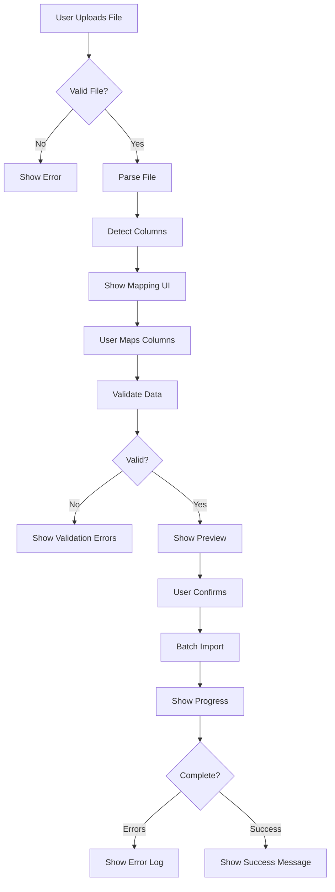

# Spreadsheet Import Architecture

**Feature:** FC-026 - Data Import System (CSV/XLSX Component)  
**Author:** Architect  
**Date:** 2025-01-26  
**Status:** Design Phase

---

## Overview

This document describes the architecture for importing financial data from CSV and XLSX files with intelligent column mapping, validation, and error handling.

### Goals
- Support CSV and XLSX file uploads (max 10MB)
- Provide intuitive column mapping interface (like ShareGate migration tool)
- Validate data before import with preview
- Track import progress and detailed error reporting
- Save mappings for reuse

### Non-Goals
- Real-time transaction streaming
- Automatic bank statement parsing (use Plaid for that)
- PDF file imports (Phase 2)

---

## File Upload Flow

### High-Level Process



### Step-by-Step Flow

1. **File Upload**
   - User drags file or clicks browse button
   - Client validates file type and size
   - File uploaded to temporary storage (Supabase Storage)

2. **File Parsing**
   - Server parses CSV/XLSX into JSON array
   - Extract column headers (first row)
   - Read first 20 rows for preview

3. **Column Detection**
   - Auto-detect column types (date, amount, text)
   - Suggest mappings based on column names
   - Example: "Transaction Date" → `date` field

4. **Column Mapping**
   - Show side-by-side mapping interface
   - User confirms or adjusts mappings
   - Option to load saved mapping preset

5. **Validation**
   - Validate each row against Fireside schema
   - Check required fields, data types, constraints
   - Collect errors with row numbers

6. **Preview**
   - Show first 10 rows with mapped columns
   - Highlight any validation warnings
   - Display summary stats (total rows, estimated duplicates)

7. **Import**
   - User clicks "Confirm Import"
   - Process rows in batches of 100
   - Update progress bar in real-time
   - Log errors for failed rows

8. **Completion**
   - Show summary (X rows imported, Y errors)
   - Option to download error log CSV
   - Save mapping for future use

---

## File Parsing Architecture

### CSV Parsing

**Library:** PapaParse (https://www.papaparse.com/)

**Features:**
- Stream parsing for large files
- Auto-detects delimiters (comma, semicolon, tab)
- Handles quoted fields with embedded commas
- Configurable encoding (UTF-8, Latin-1, etc.)

**Implementation:**
```javascript
const Papa = require('papaparse');

function parseCSV(fileBuffer) {
  return new Promise((resolve, reject) => {
    Papa.parse(fileBuffer.toString('utf-8'), {
      header: true,           // First row as headers
      skipEmptyLines: true,   // Ignore blank rows
      dynamicTyping: false,   // Keep everything as strings initially
      complete: (results) => {
        resolve({
          headers: results.meta.fields,
          rows: results.data,
          errors: results.errors
        });
      },
      error: (error) => reject(error)
    });
  });
}
```

**CSV Injection Protection:**
```javascript
// Sanitize CSV data to prevent formula injection
function sanitizeCSVValue(value) {
  if (typeof value !== 'string') return value;
  
  // Remove leading characters that could trigger formula execution
  const dangerousChars = ['=', '+', '-', '@', '\t', '\r'];
  
  if (dangerousChars.includes(value.charAt(0))) {
    return "'" + value;  // Prefix with single quote to prevent execution
  }
  
  return value;
}
```

### XLSX Parsing

**Library:** SheetJS (xlsx) (https://sheetjs.com/)

**Features:**
- Supports Excel 2007+ (.xlsx)
- Multiple sheet support (user selects sheet)
- Preserves cell formatting (dates, numbers)
- Handles merged cells

**Implementation:**
```javascript
const XLSX = require('xlsx');

function parseXLSX(fileBuffer) {
  const workbook = XLSX.read(fileBuffer, { type: 'buffer' });
  
  // Get first sheet (or let user select)
  const sheetName = workbook.SheetNames[0];
  const worksheet = workbook.Sheets[sheetName];
  
  // Convert to JSON
  const jsonData = XLSX.utils.sheet_to_json(worksheet, {
    header: 1,          // Return array of arrays
    raw: false,         // Format dates as strings
    defval: ''          // Default value for empty cells
  });
  
  return {
    headers: jsonData[0],       // First row
    rows: jsonData.slice(1),    // Remaining rows
    sheetNames: workbook.SheetNames
  };
}
```

---

## Column Detection & Auto-Mapping

### Column Type Detection

**Strategy:** Analyze column values to infer type

```javascript
function detectColumnType(values) {
  // Sample first 20 non-empty values
  const sample = values.filter(v => v && v.trim()).slice(0, 20);
  
  if (sample.length === 0) return 'text';
  
  // Check if all values are valid dates
  const dateCount = sample.filter(v => isValidDate(v)).length;
  if (dateCount / sample.length > 0.8) return 'date';
  
  // Check if all values are numbers/currency
  const numberCount = sample.filter(v => isValidNumber(v)).length;
  if (numberCount / sample.length > 0.8) return 'number';
  
  // Check if all values are boolean-like
  const boolCount = sample.filter(v => ['yes', 'no', 'true', 'false', '1', '0'].includes(v.toLowerCase())).length;
  if (boolCount / sample.length > 0.8) return 'boolean';
  
  return 'text';
}
```

### Auto-Mapping Logic

**Strategy:** Match column names to Fireside fields using keywords and aliases

```javascript
const mappingSuggestions = {
  date: ['date', 'transaction date', 'post date', 'posting date', 'trans date'],
  merchant_name: ['merchant', 'vendor', 'payee', 'description', 'name', 'store'],
  amount: ['amount', 'total', 'value', 'debit', 'credit', 'transaction amount'],
  category: ['category', 'type', 'classification', 'budget category'],
  notes: ['notes', 'memo', 'comment', 'description', 'details'],
  account: ['account', 'account name', 'bank account', 'card'],
  status: ['status', 'cleared', 'posted', 'reconciled']
};

function suggestMapping(columnName) {
  const normalized = columnName.toLowerCase().trim();
  
  for (const [field, aliases] of Object.entries(mappingSuggestions)) {
    if (aliases.some(alias => normalized.includes(alias))) {
      return field;
    }
  }
  
  return null; // No suggestion
}
```

### Confidence Scoring

Rate mapping suggestions by confidence level:

```javascript
function calculateMappingConfidence(columnName, suggestedField) {
  const normalized = columnName.toLowerCase();
  const aliases = mappingSuggestions[suggestedField];
  
  // Exact match = high confidence
  if (aliases.includes(normalized)) return 'high';
  
  // Partial match = medium confidence
  if (aliases.some(alias => normalized.includes(alias))) return 'medium';
  
  // No match = low confidence
  return 'low';
}
```

---

## Column Mapping UI Design

### Interface Layout

```
┌─────────────────────────────────────────────────────────────┐
│ Import Transactions from Spreadsheet                         │
├─────────────────────────────────────────────────────────────┤
│ File: transactions.csv (523 rows, 2.4 MB)                   │
├─────────────────────────────────────────────────────────────┤
│                                                               │
│ Map Your Columns to Fireside Capital Fields                  │
│                                                               │
│ ┌──────────────────────┬──────────────────────┐             │
│ │ Your Column          │ Fireside Field       │             │
│ ├──────────────────────┼──────────────────────┤             │
│ │ Transaction Date     │ [date ▼]       ✓     │             │
│ │ Merchant             │ [merchant_name ▼] ✓  │             │
│ │ Total                │ [amount ▼]     ✓     │             │
│ │ Type                 │ [category ▼]   ✓     │             │
│ │ Card                 │ [account ▼]    ?     │             │
│ │ Reference #          │ [- Not Mapped -]     │             │
│ └──────────────────────┴──────────────────────┘             │
│                                                               │
│ Required fields: ✓ date, merchant_name, amount               │
│ Optional fields: category, account, notes                    │
│                                                               │
│ [Load Saved Mapping ▼] [Save This Mapping]                  │
│                                                               │
│ [← Back] [Next: Preview →]                                   │
└─────────────────────────────────────────────────────────────┘
```

### Dropdown Options

**Fireside Fields (Dropdown Choices):**
- `date` - Transaction Date ⭐ Required
- `merchant_name` - Merchant/Vendor Name ⭐ Required
- `amount` - Transaction Amount ⭐ Required
- `category` - Category
- `account` - Account Name
- `notes` - Notes/Memo
- `status` - Transaction Status
- `- Not Mapped -` - Skip this column

**Visual Indicators:**
- ✓ Green checkmark = Mapped correctly
- ⚠️ Yellow warning = Optional field not mapped
- ❌ Red X = Required field not mapped
- ? Gray question = Suggested mapping (low confidence)

### Saved Mapping Presets

**Example Saved Mappings:**
- "Chase Credit Card Statement"
- "Bank of America Checking"
- "Amex Monthly Export"

**Load Mapping Flow:**
1. User selects saved mapping from dropdown
2. Auto-populate all column mappings
3. User can still adjust individual mappings
4. Validation runs automatically

**Save Mapping Flow:**
1. User clicks "Save This Mapping"
2. Prompt for mapping name
3. Store in `import_mappings` table
4. Confirm saved with toast notification

---

## Data Validation Rules

### Required Fields

| Field | Type | Validation |
|-------|------|------------|
| `date` | Date | Valid date format, not future dated |
| `merchant_name` | Text | Not empty, max 255 chars |
| `amount` | Decimal | Valid number, not zero |

### Optional Fields

| Field | Type | Validation |
|-------|------|------------|
| `category` | Text | Must exist in user's categories (or create new) |
| `account` | Text | Max 100 chars |
| `notes` | Text | Max 500 chars |
| `status` | Enum | One of: pending, posted, cleared |

### Validation Functions

```javascript
const validators = {
  date: (value) => {
    const date = new Date(value);
    if (isNaN(date)) return { valid: false, error: 'Invalid date format' };
    if (date > new Date()) return { valid: false, error: 'Future dates not allowed' };
    return { valid: true };
  },
  
  merchant_name: (value) => {
    if (!value || value.trim() === '') {
      return { valid: false, error: 'Merchant name required' };
    }
    if (value.length > 255) {
      return { valid: false, error: 'Merchant name too long (max 255 chars)' };
    }
    return { valid: true };
  },
  
  amount: (value) => {
    const num = parseFloat(value);
    if (isNaN(num)) return { valid: false, error: 'Invalid amount' };
    if (num === 0) return { valid: false, error: 'Amount cannot be zero' };
    return { valid: true };
  },
  
  category: (value) => {
    // Optional field
    if (!value) return { valid: true };
    if (value.length > 100) return { valid: false, error: 'Category name too long' };
    return { valid: true };
  }
};

function validateRow(row, mapping) {
  const errors = [];
  
  for (const [sourceColumn, targetField] of Object.entries(mapping)) {
    if (targetField === '- Not Mapped -') continue;
    
    const value = row[sourceColumn];
    const validator = validators[targetField];
    
    if (validator) {
      const result = validator(value);
      if (!result.valid) {
        errors.push({
          field: targetField,
          column: sourceColumn,
          value: value,
          error: result.error
        });
      }
    }
  }
  
  return errors;
}
```

### Duplicate Detection

**Strategy:** Check for existing transactions with same date + merchant + amount

```sql
SELECT id FROM transactions
WHERE user_id = $1
  AND date = $2
  AND merchant_name = $3
  AND amount = $4
LIMIT 1;
```

**UI Treatment:**
- Mark potential duplicates with ⚠️ icon in preview
- Allow user to choose: Skip duplicates | Import as new | Update existing

---

## Preview Interface

### Preview Table Design

```
┌─────────────────────────────────────────────────────────────┐
│ Preview Import (First 10 of 523 rows)                       │
├─────────────────────────────────────────────────────────────┤
│ ✓ All rows validated | ⚠️ 12 potential duplicates detected │
├─────────────────────────────────────────────────────────────┤
│                                                               │
│ ┌────┬────────────┬──────────────┬─────────┬──────────┐    │
│ │ #  │ Date       │ Merchant     │ Amount  │ Category │    │
│ ├────┼────────────┼──────────────┼─────────┼──────────┤    │
│ │ 1  │ 2025-01-15 │ Starbucks    │ -$5.43  │ Dining   │    │
│ │ 2  │ 2025-01-16 │ Shell Gas    │ -$48.20 │ Auto     │ ⚠️ │
│ │ 3  │ 2025-01-17 │ Amazon       │ -$124.99│ Shopping │    │
│ │ 4  │ 2025-01-18 │ Chipotle     │ -$12.35 │ Dining   │    │
│ │ 5  │ 2025-01-19 │ Rent Payment │ -$1500  │ Housing  │    │
│ └────┴────────────┴──────────────┴─────────┴──────────┘    │
│                                                               │
│ Import Settings:                                             │
│ ☑ Skip duplicate transactions                                │
│ ☑ Create new categories if needed                            │
│ ☐ Mark all as "pending" (not posted)                         │
│                                                               │
│ [← Back to Mapping] [Start Import →]                         │
└─────────────────────────────────────────────────────────────┘
```

### Summary Statistics

Display before import:
- Total rows to import
- Potential duplicates detected
- New categories to create
- Date range of transactions
- Total inflow and outflow amounts

---

## Batch Import Strategy

### Batch Processing Logic

**Why Batch?**
- Avoid database connection timeouts
- Provide incremental progress updates
- Better error isolation (failed batch doesn't break entire import)
- Respect database rate limits

**Batch Size:** 100 rows per batch (recommended)

**Implementation:**
```javascript
async function importTransactions(userId, rows, mapping, jobId) {
  const batchSize = 100;
  let successCount = 0;
  let failureCount = 0;
  const errors = [];
  
  for (let i = 0; i < rows.length; i += batchSize) {
    const batch = rows.slice(i, i + batchSize);
    
    // Transform rows according to mapping
    const transformed = batch.map((row, index) => {
      try {
        return transformRow(row, mapping, userId);
      } catch (error) {
        errors.push({
          row: i + index + 2, // +2 for header row and 0-based index
          error: error.message,
          data: row
        });
        return null;
      }
    }).filter(Boolean); // Remove nulls (failed transformations)
    
    // Insert batch into database
    const { data, error } = await supabase
      .from('transactions')
      .insert(transformed);
    
    if (error) {
      // Log batch-level errors
      for (let j = 0; j < batch.length; j++) {
        errors.push({
          row: i + j + 2,
          error: error.message,
          data: batch[j]
        });
      }
      failureCount += batch.length;
    } else {
      successCount += transformed.length;
    }
    
    // Update progress
    await updateImportJobProgress(jobId, {
      successful_rows: successCount,
      failed_rows: failureCount,
      error_log: errors
    });
    
    // Emit progress event (for real-time UI updates)
    emitProgressEvent(jobId, {
      progress: Math.round(((i + batch.length) / rows.length) * 100),
      processed: i + batch.length,
      total: rows.length
    });
  }
  
  // Mark job as complete
  await updateImportJobStatus(jobId, 'complete', {
    successful_rows: successCount,
    failed_rows: failureCount,
    error_log: errors,
    completed_at: new Date()
  });
  
  return {
    success: successCount,
    failed: failureCount,
    errors: errors
  };
}
```

### Progress Tracking

**Frontend (Polling Approach):**
```javascript
// Poll import job status every 2 seconds
const pollInterval = setInterval(async () => {
  const job = await fetch(`/api/import/jobs/${jobId}`).then(r => r.json());
  
  const progress = Math.round((job.successful_rows + job.failed_rows) / job.total_rows * 100);
  
  updateProgressBar(progress);
  updateRowCount(job.successful_rows, job.failed_rows);
  
  if (job.status === 'complete' || job.status === 'failed') {
    clearInterval(pollInterval);
    showCompletionScreen(job);
  }
}, 2000);
```

**Alternative: WebSocket Real-Time Updates**
```javascript
// WebSocket for real-time progress (more efficient)
const ws = new WebSocket(`wss://api.firesidecapital.com/import/${jobId}`);

ws.onmessage = (event) => {
  const update = JSON.parse(event.data);
  updateProgressBar(update.progress);
  updateRowCount(update.successful_rows, update.failed_rows);
  
  if (update.status === 'complete') {
    ws.close();
    showCompletionScreen(update);
  }
};
```

---

## Error Handling & Reporting

### Error Log Structure

**Error Object:**
```json
{
  "row": 42,
  "column": "amount",
  "value": "abc",
  "error": "Invalid number format",
  "suggestion": "Expected numeric value (e.g., 12.34)"
}
```

### Error Types

| Error Type | Severity | User Action |
|------------|----------|-------------|
| Missing required field | High | Fix source data, re-import |
| Invalid data type | High | Fix source data or adjust mapping |
| Duplicate transaction | Medium | Choose to skip or import anyway |
| Category not found | Low | Auto-create or map to existing |
| Row too long | Medium | Truncate or skip row |
| Database constraint violation | High | Fix data or contact support |

### Error Log Download

**Format:** CSV file with columns:
- Row Number
- Field Name
- Invalid Value
- Error Message
- Suggestion

**Example:**
```csv
Row,Field,Value,Error,Suggestion
42,amount,abc,Invalid number format,Expected numeric value (e.g. 12.34)
43,date,2025-13-40,Invalid date,Use format YYYY-MM-DD
67,merchant_name,,Required field missing,Provide merchant name
```

**Implementation:**
```javascript
function generateErrorLogCSV(errors) {
  const header = 'Row,Field,Value,Error,Suggestion\n';
  
  const rows = errors.map(e => {
    return [
      e.row,
      e.column || 'N/A',
      `"${(e.value || '').toString().replace(/"/g, '""')}"`,
      `"${e.error}"`,
      `"${e.suggestion || 'See documentation'}"`
    ].join(',');
  });
  
  return header + rows.join('\n');
}
```

---

## File Storage Strategy

### Temporary Storage

**Recommendation:** Option B (parse and discard immediately) for security

**Why Not Store Files?**
- ✅ No sensitive data at rest
- ✅ Lower storage costs
- ✅ Simpler cleanup process
- ✅ Reduces attack surface

**Implementation:**
1. User uploads file to Supabase Storage (temp bucket)
2. Backend fetches file, parses into memory
3. After parsing, delete file from storage
4. If import fails, file is already deleted (user must re-upload)

**Alternative (Phase 2):** Store files for 24 hours
- Allow user to retry failed imports without re-uploading
- Implement automatic cleanup job (delete files older than 24 hours)

### Supabase Storage Configuration

**Bucket:** `import-uploads`

**Settings:**
- Public: No
- Max file size: 10MB
- Allowed MIME types: `text/csv`, `application/vnd.openxmlformats-officedocument.spreadsheetml.sheet`
- Automatic deletion: After 24 hours (or immediate after parsing)

**RLS Policy:**
```sql
-- Users can only upload to their own folder
CREATE POLICY "Users can upload to own folder"
  ON storage.objects FOR INSERT
  WITH CHECK (
    bucket_id = 'import-uploads' AND
    (storage.foldername(name))[1] = auth.uid()::text
  );

-- Users can only read their own files
CREATE POLICY "Users can read own files"
  ON storage.objects FOR SELECT
  USING (
    bucket_id = 'import-uploads' AND
    (storage.foldername(name))[1] = auth.uid()::text
  );
```

---

## Performance Optimizations

### Large File Handling

**Problem:** Files with 10,000+ rows can be slow to process

**Solutions:**

1. **Stream Processing:**
   - Parse CSV in chunks using PapaParse streaming mode
   - Process each chunk as it arrives (don't wait for full file)

2. **Progress Indicators:**
   - Show "Parsing file..." message during upload
   - Display row count as parsing progresses

3. **Background Processing:**
   - For imports >1,000 rows, use background job queue
   - Send notification when complete

4. **Client-Side Pre-Processing:**
   - Parse CSV in browser before upload (for preview)
   - Only upload parsed JSON data (not raw file)
   - Reduces server processing time

### Database Optimizations

1. **Batch Inserts:** Use Supabase batch insert (100 rows max)
2. **Indexes:** Ensure `transactions` table has indexes on user_id, date
3. **Connection Pooling:** Reuse database connections across batches
4. **Async Operations:** Don't block on progress updates

---

## Testing Checklist

### Unit Tests
- [ ] CSV parsing (various delimiters, encodings)
- [ ] XLSX parsing (multiple sheets, formatted cells)
- [ ] Column type detection
- [ ] Auto-mapping suggestions
- [ ] Validation functions (date, amount, etc.)
- [ ] Duplicate detection logic
- [ ] Error log CSV generation

### Integration Tests
- [ ] File upload to Supabase Storage
- [ ] End-to-end import (100 rows)
- [ ] End-to-end import (1,000+ rows)
- [ ] Import with validation errors
- [ ] Import with duplicate detection
- [ ] Saved mapping CRUD operations
- [ ] Progress tracking (polling and WebSocket)

### Manual Testing
- [ ] Upload CSV with various formats (comma, semicolon, tab-delimited)
- [ ] Upload XLSX with multiple sheets
- [ ] Test column mapping UI (all field types)
- [ ] Preview with 10+ rows
- [ ] Import with some invalid rows (verify error handling)
- [ ] Save and load mapping preset
- [ ] Download error log CSV
- [ ] Import duplicate transactions (verify behavior)

### Edge Cases
- [ ] Empty file
- [ ] File with only headers (no data)
- [ ] File with non-ASCII characters
- [ ] File with very long field values (>1000 chars)
- [ ] File with missing required columns
- [ ] File with extra unmapped columns
- [ ] CSV with quoted commas in fields

---

## Security Checklist

### File Upload Security
- [ ] Validate file MIME type (not just extension)
- [ ] Enforce max file size (10MB)
- [ ] Scan for CSV injection attacks (sanitize formulas)
- [ ] Prevent path traversal attacks in filenames
- [ ] Use Supabase Storage with RLS (not local filesystem)
- [ ] Delete files after processing (no persistence of sensitive data)

### Data Validation Security
- [ ] Sanitize all imported data (XSS prevention)
- [ ] Validate amounts are within reasonable range
- [ ] Prevent SQL injection (use parameterized queries)
- [ ] Enforce database constraints (no negative amounts, etc.)
- [ ] Rate limit import API (max 5 imports per hour per user)

### Access Control
- [ ] Verify user owns import job before showing details
- [ ] Enforce RLS on all database queries
- [ ] Never expose other users' import jobs or mappings

---

## Future Enhancements

### Phase 2 Features
- PDF bank statement parsing (using AI/OCR)
- Email attachment auto-import (forward statement to inbox)
- Scheduled imports (weekly/monthly)
- Template library (pre-built mappings for popular banks)
- Bulk category assignment during import

### Advanced Features
- Multi-file upload (drag multiple CSVs)
- Merge duplicate transactions intelligently
- Transaction reconciliation (match imported vs. Plaid transactions)
- Export current transactions to CSV/XLSX

---

## References

- [PapaParse Documentation](https://www.papaparse.com/docs)
- [SheetJS Documentation](https://docs.sheetjs.com/)
- [Supabase Storage](https://supabase.com/docs/guides/storage)
- [OWASP CSV Injection](https://owasp.org/www-community/attacks/CSV_Injection)

---

**Next Steps:**
- Implement file upload API endpoint
- Build column mapping UI component
- Create validation engine
- Implement batch import logic
- Build progress tracking UI
