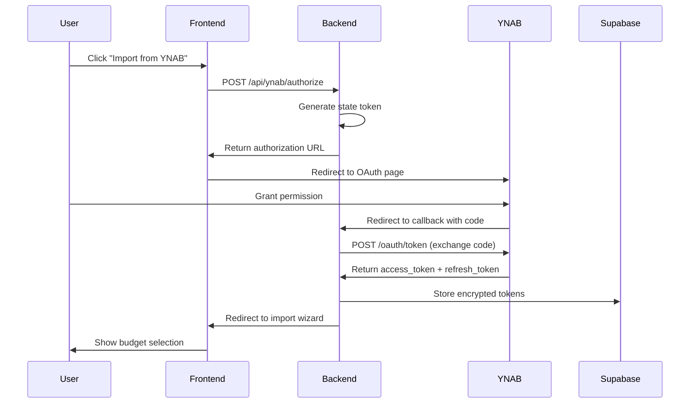

# YNAB Integration Architecture

**Feature:** FC-026 - Data Import System (YNAB Component)  
**Author:** Architect  
**Date:** 2025-01-26  
**Status:** Design Phase

---

## Overview

This document describes the architecture for integrating YNAB (You Need A Budget) with Fireside Capital, allowing users to import their existing budgets and transactions.

### Goals
- Enable one-click import of YNAB budgets and transactions
- Maintain secure OAuth authentication with YNAB API
- Map YNAB data model to Fireside Capital schema
- Provide transparent progress tracking during import

### Non-Goals
- Two-way sync between YNAB and Fireside Capital
- Real-time transaction updates from YNAB
- YNAB account reconciliation features

---

## YNAB API Overview

### API Documentation
- **Base URL:** `https://api.ynab.com/v1`
- **Documentation:** https://api.ynab.com/
- **Rate Limit:** 200 requests per hour per access token
- **Authentication:** OAuth 2.0

### Key Endpoints

| Endpoint | Method | Purpose |
|----------|--------|---------|
| `/oauth/authorize` | GET | Initiate OAuth flow |
| `/oauth/token` | POST | Exchange code for access token |
| `/v1/user` | GET | Get authenticated user info |
| `/v1/budgets` | GET | List all budgets for user |
| `/v1/budgets/{budget_id}` | GET | Get specific budget details |
| `/v1/budgets/{budget_id}/transactions` | GET | Get transactions for budget |
| `/v1/budgets/{budget_id}/categories` | GET | Get budget categories |
| `/v1/budgets/{budget_id}/accounts` | GET | Get budget accounts |

### YNAB Data Model

**Budget Structure:**
- Budget → Contains multiple accounts and categories
- Account → Checking, savings, credit cards, etc.
- Category → User-defined spending categories
- Transaction → Individual financial transactions

**Transaction Fields:**
```json
{
  "id": "string",
  "date": "2025-01-26",
  "amount": -43500,  // milliunits (negative = outflow)
  "memo": "string",
  "cleared": "cleared | uncleared | reconciled",
  "approved": true,
  "flag_color": "red | orange | yellow | green | blue | purple",
  "account_id": "string",
  "account_name": "Checking",
  "payee_id": "string",
  "payee_name": "Starbucks",
  "category_id": "string",
  "category_name": "Dining Out",
  "transfer_account_id": "string",
  "transfer_transaction_id": "string",
  "deleted": false
}
```

---

## OAuth Flow Architecture

### Flow Diagram



### OAuth Configuration

**Required Parameters:**
- `client_id`: Registered with YNAB developer portal
- `client_secret`: Stored in environment variables (server-side only)
- `redirect_uri`: `https://[app-domain]/api/ynab/callback`
- `scope`: Default scope (access to all user budgets)
- `response_type`: `code`

**State Management:**
- Generate random state token before redirect
- Store state in session or encrypted cookie
- Verify state on callback to prevent CSRF attacks

### Token Storage

**Security Requirements:**
- Store in `user_oauth_tokens` table
- Encrypt `access_token` and `refresh_token` at application layer
- Never expose tokens to frontend JavaScript
- Implement token refresh logic (YNAB tokens expire)

**Token Refresh Flow:**
```javascript
// Pseudo-code for token refresh
async function refreshYNABToken(userId) {
  const tokenRecord = await supabase
    .from('user_oauth_tokens')
    .select('*')
    .eq('user_id', userId)
    .eq('service', 'ynab')
    .single();
  
  if (!tokenRecord || !tokenRecord.refresh_token) {
    throw new Error('No refresh token available');
  }
  
  const response = await fetch('https://app.ynab.com/oauth/token', {
    method: 'POST',
    headers: { 'Content-Type': 'application/json' },
    body: JSON.stringify({
      grant_type: 'refresh_token',
      refresh_token: decrypt(tokenRecord.refresh_token),
      client_id: process.env.YNAB_CLIENT_ID,
      client_secret: process.env.YNAB_CLIENT_SECRET
    })
  });
  
  const { access_token, refresh_token, expires_in } = await response.json();
  
  await supabase
    .from('user_oauth_tokens')
    .update({
      access_token: encrypt(access_token),
      refresh_token: encrypt(refresh_token),
      expires_at: new Date(Date.now() + expires_in * 1000)
    })
    .eq('id', tokenRecord.id);
  
  return access_token;
}
```

---

## Field Mapping Specification

### Transaction Mapping

| YNAB Field | Fireside Field | Transformation |
|------------|----------------|----------------|
| `date` | `date` | Direct (ISO 8601) |
| `payee_name` | `merchant_name` | Direct |
| `amount` | `amount` | Divide by 1000, invert sign if needed |
| `memo` | `notes` | Direct |
| `category_name` | `category` | Via category mapping table |
| `account_name` | `account` | Direct or via account mapping |
| `cleared` | `status` | Map: cleared→posted, uncleared→pending |
| `id` | N/A | Store in metadata for deduplication |

**Amount Conversion:**
```javascript
// YNAB uses milliunits (e.g., -43500 = -$43.50)
// Negative = outflow (expense), Positive = inflow (income)
function convertYNABAmount(ynabAmount) {
  return ynabAmount / 1000;
  // Result: -43.50 for expense, 43.50 for income
}
```

### Category Mapping

**Strategy:** Intelligent mapping with user override

1. **Automatic Mapping** (Phase 1):
   - Direct name match (e.g., "Groceries" → "Groceries")
   - Fuzzy match with similarity threshold (e.g., "Dining Out" → "Restaurants")
   - Common aliases (e.g., "Gas" → "Transportation")

2. **User Override** (Phase 2):
   - Show unmapped categories to user
   - User maps YNAB categories to Fireside categories
   - Save mapping in `metadata` for future imports

**Category Mapping Table:**
```javascript
const categoryMap = {
  // YNAB Category → Fireside Category
  "Groceries": "Groceries",
  "Dining Out": "Restaurants",
  "Gas & Fuel": "Transportation",
  "Electricity": "Utilities",
  "Water": "Utilities",
  "Internet": "Utilities",
  "Rent/Mortgage": "Housing",
  "Home Maintenance": "Home Maintenance",
  "Cell Phone": "Phone",
  "Clothing": "Shopping",
  // ... extend as needed
};
```

### Budget Mapping

YNAB budgets are month-specific. We need to:

1. Extract month and year from YNAB budget
2. Map YNAB category budgets to Fireside `budgets` table
3. Handle budget rollover (YNAB's "Ready to Assign" balance)

**Budget Import Structure:**
```javascript
{
  month: "2025-01-01",
  category: "Groceries",
  budgeted: 500.00,
  activity: -347.23,  // actual spending
  balance: 152.77     // remaining budget
}
```

---

## Backend Endpoint Specifications

### 1. POST `/api/ynab/authorize`

**Purpose:** Initiate YNAB OAuth flow

**Request:**
```json
{
  "redirect_uri": "https://app.firesidecapital.com/import"
}
```

**Response:**
```json
{
  "authorization_url": "https://app.ynab.com/oauth/authorize?client_id=...&redirect_uri=...&response_type=code&state=..."
}
```

**Logic:**
1. Generate random state token (store in session/cookie)
2. Build authorization URL with client_id, redirect_uri, state
3. Return URL to frontend
4. Frontend redirects user to authorization_url

---

### 2. GET `/api/ynab/callback`

**Purpose:** Handle OAuth redirect from YNAB

**Query Parameters:**
- `code`: Authorization code from YNAB
- `state`: State token for CSRF protection

**Response:** Redirect to `/import?status=success` or `/import?status=error`

**Logic:**
1. Verify state token matches session
2. Exchange code for access token (POST to YNAB)
3. Decrypt and store access_token, refresh_token in database
4. Store expires_at timestamp
5. Redirect user to import wizard

**Error Handling:**
- Invalid state → 403 Forbidden
- Failed token exchange → 500 Internal Server Error
- Database error → 500 Internal Server Error

---

### 3. GET `/api/ynab/budgets`

**Purpose:** Fetch user's YNAB budgets

**Authentication:** Requires valid session (user must be authenticated)

**Response:**
```json
{
  "budgets": [
    {
      "id": "ynab-budget-id-1",
      "name": "My Personal Budget",
      "last_modified_on": "2025-01-26T10:00:00Z",
      "currency_format": {
        "iso_code": "USD",
        "symbol": "$"
      }
    }
  ]
}
```

**Logic:**
1. Get user's YNAB access token from database
2. Check if token is expired (refresh if needed)
3. Call YNAB API: GET /v1/budgets
4. Return budget list to frontend
5. Handle rate limiting (cache results for 1 hour)

---

### 4. POST `/api/ynab/import`

**Purpose:** Import transactions from selected YNAB budget

**Request:**
```json
{
  "budget_id": "ynab-budget-id-1",
  "account_ids": ["account-1", "account-2"],  // Optional: filter by accounts
  "since_date": "2024-01-01",                 // Optional: only import from date
  "category_map": {                           // Optional: custom category mapping
    "Dining Out": "Restaurants",
    "Gas & Fuel": "Transportation"
  }
}
```

**Response:**
```json
{
  "import_job_id": "uuid",
  "status": "processing",
  "total_transactions": 523
}
```

**Logic:**
1. Create `import_job` record with status "pending"
2. Fetch transactions from YNAB API (with pagination)
3. Transform each transaction using field mapping
4. Validate transformed data
5. Batch insert into `transactions` table (100 rows at a time)
6. Update `import_job` with progress (via websocket or polling)
7. On completion, update status to "complete" or "failed"

**Batch Processing:**
```javascript
async function importYNABTransactions(userId, budgetId, options) {
  const job = await createImportJob(userId, 'ynab', { budget_id: budgetId });
  
  try {
    // Fetch all transactions (handle pagination)
    let allTransactions = [];
    let hasMore = true;
    let page = 0;
    
    while (hasMore) {
      const response = await fetchYNABTransactions(budgetId, page);
      allTransactions = allTransactions.concat(response.transactions);
      hasMore = response.hasMore;
      page++;
      
      // Respect rate limits (200 req/hour = ~3 seconds between requests)
      await sleep(3000);
    }
    
    await updateImportJob(job.id, { total_rows: allTransactions.length });
    
    // Transform and import in batches
    const batchSize = 100;
    for (let i = 0; i < allTransactions.length; i += batchSize) {
      const batch = allTransactions.slice(i, i + batchSize);
      const transformed = batch.map(t => transformYNABTransaction(t, options));
      
      const result = await supabase
        .from('transactions')
        .insert(transformed);
      
      if (result.error) {
        await logImportError(job.id, i, result.error);
      }
      
      await updateImportProgress(job.id, i + batch.length);
    }
    
    await updateImportJob(job.id, { 
      status: 'complete',
      completed_at: new Date()
    });
    
  } catch (error) {
    await updateImportJob(job.id, { 
      status: 'failed',
      error_log: [{ error: error.message }]
    });
  }
}
```

---

### 5. DELETE `/api/ynab/disconnect`

**Purpose:** Revoke YNAB access and delete tokens

**Response:**
```json
{
  "success": true,
  "message": "YNAB connection removed"
}
```

**Logic:**
1. Delete user's record from `user_oauth_tokens` (service='ynab')
2. Optional: Call YNAB token revocation endpoint
3. Return success confirmation

---

## Rate Limiting Strategy

**YNAB API Limit:** 200 requests per hour per access token

**Mitigation Strategies:**

1. **Caching:**
   - Cache budget list for 1 hour
   - Cache transaction list for 30 minutes (configurable)

2. **Batch Operations:**
   - Use `since_date` parameter to fetch only new transactions
   - Implement pagination with rate-limit-aware delays

3. **User Feedback:**
   - Show "Import in progress" message
   - Display estimated time based on transaction count
   - Example: "Importing 500 transactions (estimated 2-3 minutes)"

4. **Background Processing:**
   - Use job queue for large imports (>200 transactions)
   - Send notification when complete

---

## Duplicate Detection

**Problem:** User might import same transactions multiple times

**Solution:** Idempotent import with deduplication

**Strategy:**
1. Store YNAB transaction ID in transaction metadata: `{ "ynab_id": "..." }`
2. Before inserting, check if transaction with same `ynab_id` exists
3. If exists, skip or update (user preference)

**SQL Check:**
```sql
SELECT id FROM transactions 
WHERE user_id = $1 
  AND metadata->>'ynab_id' = $2
LIMIT 1;
```

**User Options:**
- Skip duplicates (default)
- Update existing transactions
- Import as new (with warning)

---

## Error Handling

### Common Errors

| Error | Cause | Solution |
|-------|-------|----------|
| 401 Unauthorized | Expired token | Auto-refresh token, retry |
| 403 Forbidden | Invalid permissions | Prompt re-authorization |
| 404 Not Found | Budget deleted | Show error, remove from list |
| 429 Too Many Requests | Rate limit hit | Queue request, retry after delay |
| 500 Server Error | YNAB API issue | Retry with exponential backoff |

### User-Facing Messages

```javascript
const errorMessages = {
  'token_expired': 'Your YNAB connection has expired. Please reconnect.',
  'rate_limit': 'YNAB rate limit reached. Import will resume in a few minutes.',
  'budget_not_found': 'Selected budget no longer exists in YNAB.',
  'network_error': 'Unable to connect to YNAB. Please check your internet connection.',
  'import_failed': 'Import failed due to an unexpected error. Please try again.'
};
```

---

## Testing Checklist

### Unit Tests
- [ ] Token encryption/decryption
- [ ] Amount conversion (milliunits → dollars)
- [ ] Category mapping logic
- [ ] Date format transformation
- [ ] Duplicate detection

### Integration Tests
- [ ] OAuth flow end-to-end
- [ ] Token refresh mechanism
- [ ] Budget list fetching
- [ ] Transaction import (small dataset)
- [ ] Error handling (expired tokens, rate limits)

### Manual Testing
- [ ] Import from YNAB sandbox account
- [ ] Import 100+ transactions
- [ ] Import with custom category mapping
- [ ] Disconnect and reconnect YNAB
- [ ] Import duplicate transactions (verify deduplication)

---

## Security Considerations

### Token Security
- ✅ Encrypt tokens before storing in database
- ✅ Never expose tokens in API responses
- ✅ Use HTTPS for all API communication
- ✅ Implement CSRF protection (state token)
- ✅ Rotate encryption keys regularly

### Data Privacy
- ✅ User data stored with RLS policies
- ✅ Import jobs only visible to owner
- ✅ OAuth tokens only accessible to owner
- ✅ No logging of sensitive financial data

### API Security
- ✅ Rate limit API endpoints (per user)
- ✅ Validate all input parameters
- ✅ Sanitize YNAB data before database insert
- ✅ Implement timeout for long-running imports

---

## Future Enhancements

### Phase 2 Features
- Two-way sync (Fireside → YNAB)
- Scheduled automatic imports (daily/weekly)
- Transaction reconciliation
- Budget comparison reports (YNAB vs. Fireside)

### Performance Optimizations
- Parallel transaction fetching
- Incremental imports (only new transactions)
- Real-time progress updates via WebSocket

---

## References

- [YNAB API Documentation](https://api.ynab.com/)
- [OAuth 2.0 RFC](https://datatracker.ietf.org/doc/html/rfc6749)
- [Supabase Auth Documentation](https://supabase.com/docs/guides/auth)

---

**Next Steps:**
- Register app with YNAB Developer Portal
- Obtain `client_id` and `client_secret`
- Implement OAuth endpoints in backend
- Build import wizard UI (see `import-wizard-ux-flow.md`)
